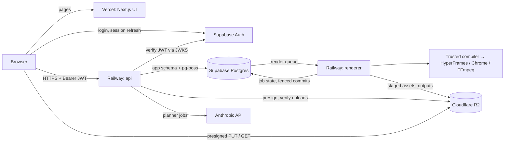

# Architecture and implementation specification

> Current implementation and live infrastructure: [Application, infrastructure and storage guide](SYSTEM_GUIDE.md). This document also contains historical plans; consult the guide and [release status](MVP_RELEASE_STATUS.md) for the October 8, 2026 production topology.

Status: planned architecture; hosted stack selected 2026-10-02. Nothing is deployed. The reasoning behind each vendor and library choice is in [Stack decisions](STACK_DECISIONS.md).

## 1. System boundaries



Request flow:

1. The browser loads the UI from Vercel and signs in with Supabase Auth.
2. Every data request goes directly from the browser to `api.<domain>` with the Supabase access token.
3. The API verifies the token, authorizes against workspace membership, validates the body, writes Postgres, and enqueues work. Long operations return `202` with a job ID.
4. The planner consumer (inside `backend`) and the `worker` service pick jobs from pg-boss, update our `jobs` table, and write outputs to R2.
5. The browser polls `GET /v1/jobs/:id`. Server-sent events are added only if polling becomes a measured problem; polling remains the recovery path.

Why this split: rendering needs long-lived containers with Chrome and FFmpeg, so it cannot run on serverless functions; the API needs persistent database and queue connections, so it lives next to the renderer on Railway; the frontend is UI only, so it gets the most mature Next.js host.

## 2. Deployment units

| Unit | Host | Responsibilities | Must not have | Scaling |
| --- | --- | --- | --- | --- |
| `web` | Vercel | Next.js pages, Supabase login, API client, uploads/downloads via presigned URLs | Database URL, R2 keys, model key, service-role key | Vercel managed |
| `backend` | Railway | HTTP API, JWT verification, authorization, presigning, upload verification, enqueue, planner consumer, scheduled maintenance (reaper, retention) | Chrome/FFmpeg rendering | 1–2 replicas; split planner out if needed |
| `worker` | Railway (Docker) | Render queue consumer: stage assets, compile, check, render, probe, upload, fenced commit | Model key, Supabase Auth secrets, user tokens, broad R2 credentials | Fixed replica count; 1 job per replica |
| Auth + DB | Supabase (one project per environment) | Users and sessions; Postgres with `app` and pg-boss schemas | Exposure of `app` tables through the Data API | Plan tier |
| Media | Cloudflare R2 (bucket pair per environment) | Private uploads and outputs | Public access, `r2.dev` URLs | Managed |

## 3. Technology decisions by phase

| Layer | Local proof (M1–M2) | Local app (M3) | Hosted beta (M4+) |
| --- | --- | --- | --- |
| Runtime | TypeScript on Node 24 LTS | Same | Same, in Docker for `worker` |
| Repo | npm workspaces | Same | Same |
| UI | CLI and rendered MP4 | Next.js 16 on `next dev` | Next.js on Vercel |
| API | None (CLI calls packages) | Fastify on `localhost` | Fastify on Railway |
| Validation | Zod schemas | Shared `packages/contracts` | Same at API and worker boundaries |
| Metadata | JSON manifests | Local Postgres (same major as Supabase) via Drizzle | Supabase Postgres, same migrations |
| Jobs | Sequential local runner | pg-boss on local Postgres, separate renderer process | pg-boss on Supabase |
| Media | Project filesystem | Filesystem storage adapter | R2 storage adapter |
| Auth | None | None; API bound to loopback with one seeded workspace | Supabase Auth, membership-based authorization |
| AI | Human-authored fixtures, then Anthropic adapter | Same adapter | Same, with quotas and timeouts |
| Rendering | Pinned HyperFrames with local Chrome/FFmpeg | Same, as a separate worker process (optionally the Docker image) | Versioned Linux Docker image on Railway |
| Observability | Run reports | pino logs | pino + Sentry, Railway logs and metrics |
| Payments | None | None | Stripe at M5 |

Postgres from M3 replaces the earlier SQLite plan. One database means one set of migrations, one queue implementation, and one leasing/fencing implementation. Local Postgres comes from Postgres.app or Homebrew; the Supabase CLI local stack is optional because it needs Docker, which was unavailable in the initial environment check.

Pin Node 24 LTS only after confirming the pinned HyperFrames release supports it (see [Stack decisions D8](STACK_DECISIONS.md#d8--node-24-lts-and-npm-workspaces)).

## 4. Repository structure

Each top-level app folder is one deployable unit with its own Dockerfile or platform settings and its own env files ([Deployment map](DEPLOYMENT.md)). npm workspaces link `frontend`, `backend`, and `packages/*`; the worker keeps its own lockfile because its HyperFrames dependency tree is only needed inside its image.

```text
frontend/                 # Next.js UI → Vercel (Root Directory: frontend)
backend/                  # Fastify API + planner + job state → Railway service "backend" (backend/Dockerfile)
worker/                   # Render worker → Railway service "worker" (worker/Dockerfile)
cli/                      # Local prepare, plan, render, revise, inspect (M1, when needed)
packages/
  contracts/              # Shared request/job/storyboard types (browser-safe) — exists
  api-client/             # Typed fetch client for the frontend (browser-safe)
  planner/                # Anthropic adapter, prompts, output validation and repair
  compiler/               # Storyboard → trusted HTML/timeline
  templates/              # Scene implementations, landscape and portrait layouts
  render-engine/          # HyperFrames process wrapper, output probes, frame sampling
  storage/                # StorageAdapter: filesystem and R2 implementations
  db/                     # Drizzle schema, SQL migrations, repositories
  jobs/                   # pg-boss setup, queue names, payload schemas, fencing helpers
  auth/                   # Supabase JWT verification, AuthContext
  telemetry/              # pino logger, Sentry setup, request IDs, cost metrics
.railway/railway.ts       # Railway Infrastructure as Code for backend + worker
compose.yaml              # Local worker (+ postgres)
fixtures/                 # Non-sensitive, licensed test inputs
validation/               # Smoke project and reproducible experiments
docs/                     # Plans, decisions, runbooks, validation results
var/                      # Ignored local outputs (var/renders shared by worker and backend)
```

Dependency rule: `frontend` may import only `packages/contracts` and `packages/api-client`. It must never import `db`, `storage`, `jobs`, `auth`, `planner`, `compiler`, or `render-engine`. Enforce this with a lint rule so a server secret can never be bundled into the browser.

Create packages when their first implementation is needed; this is the target layout, not a requirement to scaffold empty abstractions.

Current state (2026-10-02): the prompt-based prototype has been split into `frontend`, `backend`, and `worker`. Its backend logic (in-memory job store, prompt planner, HTTP call to the worker) is still prototype code; JOB-01 replaces the HTTP call with pg-boss, DB-01 replaces the in-memory store, and the storyboard contracts replace the prompt contract (see [Frontend plan](WEB_APP_IMPLEMENTATION.md)).

Update (2026-10-04): JOB-01 is implemented for local use. Render jobs are rows in Postgres (`app.render_jobs`), and the HTTP call to the worker is replaced by pg-boss queues (`render-plan` → `render-video` → `render-finished`). See §12 "Implementation status" and [Render queue](RENDER_QUEUE.md). The in-memory job store is gone. Projects and brand kits moved from JSON files to Postgres on 2026-10-07 (see §9).

## 5. Authentication and authorization

> Implementation status (2026-10-07): sign-in, JWT verification, per-user ownership (404 for others' records) and RLS are built and deployed; see [Authentication, ownership and data](AUTH_AND_DATA.md). Not yet built from this section: `users`/workspaces/memberships (ownership is per Supabase user id), `X-Workspace-Id`, and the Data API privilege revokes (RLS read-only policies are in place instead).

### Sign-in and token flow

1. `frontend` uses `@supabase/ssr` / `supabase-js` for sign-up, login, password reset, and session refresh.
2. For each API call the client reads the current access token and sends `Authorization: Bearer <token>`. Tokens are not shared through cookies across domains, which avoids CSRF handling.
3. `packages/auth` verifies the token in the API: signature against the project's JWKS endpoint (asymmetric signing keys; verify the project is configured this way), issuer `https://<project-ref>.supabase.co/auth/v1`, audience `authenticated`, and expiry. A failed check returns `401`.
4. The token's `sub` maps to `users.auth_subject`. The first authenticated request creates the user and a personal workspace in one idempotent transaction.
5. Each request builds an `AuthContext { requestId, userId, workspaceId, role }`. A client may select a workspace with an `X-Workspace-Id` header, but the API checks membership before using it.

### Authorization rules

- Every repository function requires an `AuthContext` and filters by `workspace_id`.
- Verify parent-child ownership (asset belongs to project belongs to workspace), not only the submitted IDs.
- Return `404`, not `403`, for objects in another workspace, so IDs cannot be probed.
- Workers receive job IDs only. They reload rows from the database and check job state and lease before acting.

### Supabase Data API lockdown

Supabase exposes some schemas through its auto-generated REST API to holders of the public anon/publishable key. Application data must not be reachable that way:

- Create app tables in schema `app` and pg-boss tables in schema `pgboss`; neither is in the exposed-schema list.
- Revoke all privileges on `app` and `pgboss` from the `anon` and `authenticated` roles.
- Any table that must live in `public` has RLS enabled with no policies (deny all).
- Disable the Data API entirely if no feature needs it.
- QA-02 includes a test that calls the Data API with the anon key and expects no access.

### Cross-origin rules

- CORS allowlist: the production frontend origin; in staging, also the Vercel preview pattern scoped to our team (for example `https://videosaas-*-<team>.vercel.app`), never a bare `*.vercel.app`.
- Allowed headers: `Authorization`, `Content-Type`, `Idempotency-Key`, `If-Match`, `X-Workspace-Id`, `X-Request-Id`. Credentials mode is not used.
- Supabase Auth redirect URLs list only our frontend origins per environment.

### Downloads and playback

A plain link cannot carry a bearer header. The browser calls `GET /v1/renders/:id/download` with its token; the API authorizes and returns a short-lived presigned R2 URL (about 15 minutes) as JSON; the browser then navigates to it or uses it as the `<video>` source. On playback expiry the client requests a fresh URL.

## 6. Shared contracts

### Brief v1

- `schemaVersion`, `projectId`, `brandVersionId`, `language`.
- `productName`, `audience`, `promise`, `approvedClaims[]`, `cta`.
- `features[]`: approved copy, source asset ID, optional evidence label.
- `format`: landscape/portrait; `durationFrames`: 600; `fps`: 30.
- `styleId`, ordered asset IDs; optional constraints.

### Storyboard v1

- `schemaVersion`, `revisionId`, `parentRevisionId`, `briefRevisionId`, `status` (`proposed`, `draft`, `approved`).
- `templateVersion`, `brandVersionId`, `width`, `height`, `fps`, `durationFrames`.
- `scenes[]`: stable ID, scene type, integer start/duration frames, text fields, asset IDs, focal region, animation preset, claim IDs.
- `focalRegion`: normalized `x`, `y`, `width`, `height`, each bounded to the image; the compiler computes the safe fit/crop.
- `audio`: optional approved asset IDs and exact placement; absent for the first prototype.
- `provenance`: human/model origin, provider/model, prompt version, input hashes, generation timestamp.

Example scene data (contract illustration, not executable composition):

```json
{
  "id": "feature-1",
  "type": "screenshot-focus",
  "startFrame": 90,
  "durationFrames": 120,
  "headline": "See profit after fees",
  "assetId": "asset-dashboard",
  "claimIds": ["claim-1"],
  "focalRegion": {"x": 0.1, "y": 0.15, "width": 0.65, "height": 0.5},
  "animationPreset": "gentle-zoom"
}
```

Timing rule: scenes are contiguous, start at frame 0, and their durations sum exactly to `durationFrames` (600 in v1). Changing one scene's duration takes or gives frames from an adjacent scene; the editor shows which. Each scene type has a minimum and maximum duration. A fixed total keeps the template's pacing tested and pricing predictable; variable length is a later feature.

Validation: stable unique scene IDs, timing rule above, known scene/preset IDs, resolvable assets, allowed colors/fonts, copy limits, valid crop bounds, and references to approved claims. Model output may contain no arbitrary JS, CSS, HTML, URLs, or shell fragments. Escape text during compilation. Distinguish non-fatal quality warnings from invalid contracts.

### Job v1 (API view)

```ts
type Job = {
  id: string;
  kind: "plan" | "revise" | "render-draft" | "render-final";
  state: "queued" | "running" | "retry_wait" | "cancel_requested" | "succeeded" | "failed" | "cancelled";
  stage?: "staging" | "compiling" | "checking" | "rendering" | "probing" | "uploading" | "publishing";
  progress?: { framesRendered: number; totalFrames: number }; // only when the renderer reports real counts
  projectId: string;
  revisionId: string;
  attempt: number;
  createdAt: string;
  updatedAt: string;
  result?: { revisionId?: string; renderId?: string };
  error?: { code: string; message: string; retryable: boolean; diagnosticId: string };
};
```

Never fabricate a percentage or ETA. If no real frame count is available, the UI shows the stage name only.

### Revision and approval

Every edit creates an immutable revision. Use optimistic concurrency: the client sends the base revision ID in `If-Match`; stale edits receive `409 Conflict`. Approval records the revision hash and export-settings hash. Any content change needs a new approval. A final render always references that exact snapshot, never a mutable project pointer.

## 7. Frontend routes and states

| Route | Main components | Important states |
| --- | --- | --- |
| `/login`, `/signup` | Supabase auth forms | Invalid credentials, unverified email, reset sent |
| `/projects` | Project grid, create dialog | Empty, loading, error, archived |
| `/projects/new` | Brief form, uploads, brand picker | Uploading, invalid brief, ready to plan |
| `/projects/:id` | Overview, revision history, outputs | Draft, processing, ready, failed |
| `/projects/:id/storyboard` | Scene cards, crop editor, copy/timing controls | Unsaved, saving, stale edit, proposed AI change, approved |
| `/projects/:id/preview` | Video player, scene navigation, feedback | Queued, rendering, ready, failed, cancelled |
| `/brands/:id` | Logo/colors/font/CTA form | Missing asset, invalid color, version saved |
| `/settings/usage` | Usage, limits, billing link | Within quota, quota exceeded, payment pending |

The app is behind login and has no SEO needs, so authenticated data is fetched client-side with TanStack Query through `packages/api-client`. Server components render only the shell and public pages. This keeps a single auth path (browser token → API) instead of two.

Keep server state authoritative. Upload progress and unsaved form state are local UI state. Poll active jobs every 2–5 seconds, back off when the tab is hidden, and refetch durable status on reload.

Preview the rendered MP4 for final review. An optional HTML preview, if built, runs on a separate origin with no app cookies or tokens and restricted network access. Rendering code must never execute in the authenticated application's DOM.

Detailed frontend structure and acceptance checks: [Frontend plan](WEB_APP_IMPLEMENTATION.md).

## 8. API surface

Base URL `https://api.<domain>/v1`. JSON errors use `{code, message, fieldErrors?, retryable, requestId}`. Authenticate all hosted requests, derive workspace from membership, validate bodies with shared Zod schemas, and paginate list endpoints.

| Method and route | Behavior |
| --- | --- |
| `GET /healthz`, `GET /readyz` | Liveness; readiness checks database and queue |
| `GET /me` | Current user and workspace memberships (creates them on first call) |
| `POST /projects` | Create project and initial brief |
| `GET /projects`, `GET /projects/:id` | List/read authorized projects |
| `PATCH /projects/:id` | Update mutable metadata with concurrency check |
| `POST /brands`, `POST /brands/:id/versions` | Create brand/version |
| `POST /projects/:id/assets/upload-intent` | Validate declared type/size, create pending asset, return presigned PUT |
| `POST /projects/:id/assets/:assetId/complete` | Verify stored object size/type/hash/dimensions; mark verified or rejected |
| `POST /projects/:id/plans` | Queue planning; `202 {jobId}` |
| `GET /projects/:id/revisions` | List immutable storyboard revisions |
| `POST /projects/:id/revisions` | Save validated manual revision from base revision |
| `POST /projects/:id/revisions/:revisionId/changes` | Queue scoped AI patch; `202 {jobId}`; result is a `proposed` revision |
| `POST /projects/:id/revisions/:revisionId/comments`, `GET /projects/:id/comments`, `PATCH /comments/:id` | Timeline comments anchored to time, range, point, and element ([Editing §5](EDITING.md#5-timeline-comments--ai-edits)) |
| `POST /projects/:id/revisions/:revisionId/ai-edits` | Queue AI edits for selected comments; `202 {jobId}`; result is a `proposed` revision |
| `POST /brands/extract`, `PUT /brands/assets/:kind`, `POST /brands`, `GET /brands`, `GET /brands/:id/logo` | Brand kits: SSRF-safe website import, verified logo/font uploads, derived theme ([Brand and audio](BRAND_AND_AUDIO.md)) |
| `POST /projects/:id/approvals` | Approve revision hash and export settings |
| `POST /projects/:id/renders` | Reserve usage and queue draft/final job; `202 {jobId}` |
| `GET /jobs/:id` | Job view (§6) |
| `POST /jobs/:id/cancel` | Idempotent cancellation request |
| `GET /renders/:id/download` | Authorize, return short-lived presigned URL |
| `DELETE /projects/:id` | Tombstone project, cancel work, queue private-media deletion |
| `POST /billing/webhook` | Verify Stripe signature and deduplicate events (M5) |

Require an `Idempotency-Key` header for planning, revision-change, and render mutations. Persist its request-body hash; repeated identical requests return the same result, while reuse with a different payload returns `409`. Handle idempotency separately from input-based caching.

Rate-limit per user and workspace with `@fastify/rate-limit`; stricter limits on planning and render routes.

## 9. Persistence model

> Implementation status (2026-10-07): built tables are `app.render_jobs`, `app.projects` and `app.brand_kits` (jsonb documents with `owner_id`), migrated by the backend's own runner (`backend/src/db/migrations`), not Drizzle. See [Authentication, ownership and data](AUTH_AND_DATA.md#data-model-postgres-schema-app).

Supabase Postgres, schema `app` for application tables, schema `pgboss` for the queue. Drizzle defines the schema in `packages/db`; generated SQL migrations are reviewed and committed, and applied by the `backend` service's Railway pre-deploy command. Migrations are backward compatible (expand first, contract only after old versions are drained), so a rollback never meets an incompatible schema.

All tenant-owned rows carry `workspace_id`. Use foreign keys, unique constraints, indexes on workspace/project and status/time, and transactions for invariants.

| Entity | Key fields and relationships |
| --- | --- |
| `users` | Internal UUID, `auth_subject` (Supabase `sub`, unique), email |
| `workspaces`, `memberships` | Owner, user, role; unique workspace/user |
| `projects` | Workspace, name, current brief/revision pointers, tombstone |
| `brands`, `brand_versions` | Immutable palette/font/logo/CTA snapshots |
| `assets` | Workspace/project, object key, checksum, MIME, size, dimensions, status (`pending`, `verified`, `rejected`) |
| `brief_revisions` | Versioned approved copy and input asset references |
| `storyboard_revisions` | Parent, status, schema/template version, JSON document, content hash |
| `timeline_comments`, `ai_edit_proposals` | Anchored comments and validated AI operation sets ([Editing §6](EDITING.md#6-api-and-data-additions)) |
| `approvals` | Revision hash, settings hash, actor, timestamp |
| `jobs`, `job_attempts` | Kind, revision, state, stage, current attempt (fencing token), heartbeat, error, timings |
| `render_outputs` | Successful attempt, object keys, probe metadata, hashes |
| `usage_ledger` | Reservation, settlement, release; unique operation IDs |
| `billing_accounts`, `webhook_events` | Provider IDs and processed-event deduplication |
| `idempotency_records` | Workspace, key, request hash, response/job reference |
| `outbox_events` | Only if pg-boss cannot enqueue inside the app transaction |

Connections: `backend` and `worker` use the Supabase session-mode pooler connection string with small pools (start: `backend` 10, `worker` 3 per replica). Check the total against the plan's connection limit before adding replicas.

Store binary media in R2, not SQL. JSON storyboard documents are schema-versioned and immutable. A retention task removes unreferenced objects only after a grace period.

## 10. Storage (Cloudflare R2)

Buckets per environment: `videosaas-<env>-uploads` and `videosaas-<env>-outputs`. Both private; no public bucket access or `r2.dev` URLs.

Keys are generated by the server; filenames are display metadata only:

```text
uploads:  incoming/<assetId>                                    (unverified, lifecycle-expired)
          ws/<workspaceId>/proj/<projectId>/assets/<assetId>/original
outputs:  ws/<workspaceId>/proj/<projectId>/renders/<renderId>/attempts/<attemptId>/video.mp4
          ws/<workspaceId>/proj/<projectId>/renders/<renderId>/frames/<n>.png
```

Upload flow:

1. `upload-intent`: the API validates declared MIME (PNG/JPEG) and size, creates an `assets` row with status `pending`, and returns a presigned PUT for `incoming/<assetId>` with the expected `Content-Type`, valid for about 10 minutes.
2. The browser uploads directly to R2.
3. `complete`: the API checks the object size, streams it, decodes it with `sharp` to verify the real type, dimensions, and pixel-count limit, computes SHA-256, copies it to the permanent key, deletes the incoming object, and marks the asset `verified`. Any failure marks it `rejected` and deletes the object.
4. An R2 lifecycle rule expires anything left under `incoming/` after 24 hours.

Assume R2 presigned PUTs cannot enforce a maximum size (verify); step 3 is therefore mandatory, not a convenience.

Tokens: the `backend` token can read and write both buckets. The `worker` token can read the uploads bucket and write the outputs bucket only. Rendered pages never see storage credentials; the renderer downloads assets to local disk before compiling.

Bucket CORS: allow `PUT` (uploads) and `GET` (outputs) only from the environment's frontend origins.

Local development uses the filesystem implementation of the same `StorageAdapter`; presigned URLs are emulated by API endpoints with HMAC-signed, expiring tokens on `localhost`.

Retention (proposed for beta): scratch files 24 hours, failed-run diagnostic media 7 days, exports 30 days, source assets while the project exists. Show these rules before uploads and confirm commercial policy before launch. Project deletion immediately revokes access and schedules object deletion. Exports can be re-rendered from immutable revisions, so source assets and the database are the data that must be backed up.

## 11. Planning and composition pipeline

1. Validate the brief, inspect image dimensions, and load approved brand assets.
2. The planner consumer in `backend` requests a constrained storyboard from the Anthropic API using tool output; operator-authored storyboards are also supported.
3. Validate against schema and source claims. One bounded repair attempt is allowed; unresolved issues are surfaced for editing.
4. The user approves content and crops. Draft rendering may happen before approval; final export requires approval.
5. The renderer stages assets into a per-attempt directory; the compiler resolves trusted templates and local asset paths and writes a complete composition bundle.
6. The render engine runs structural/runtime checks and renders.
7. Probe the MP4, capture scene review frames, and save diagnostics.
8. Upload outputs to the attempt key, verify them, then commit the database reference with a fenced update; only then mark the job succeeded and settle usage.

Pin animation and font assets inside the renderer image so network availability cannot change output. Use frame-based timing and deterministic seeds for decorative randomness. Maintain separate portrait and landscape layouts so a vertical export reflows content.

Editing tiers (beginner variables + live player, pro Studio) and timeline-comment AI edits are specified in [Editing and AI revisions](EDITING.md). A natural-language revision becomes a proposed schema patch restricted to selected scene fields. Present the change for approval; do not regenerate the entire composition. Any copy claim introduced by AI must point to supplied evidence or be flagged for user confirmation.

## 12. Job lifecycle and worker protocol

```text
queued ──────────────▶ running ──────────────▶ succeeded
  │                     │  │  │
  │ cancel              │  │  └─ transient failure ─▶ retry_wait ─▶ queued
  ▼                     │  └──── permanent failure or retries exhausted ─▶ failed
cancelled ◀── cancel_requested ◀── cancel
```

`running` carries a separate `stage` (§6). Terminal states (`succeeded`, `failed`, `cancelled`) are immutable; a manual retry creates a new job.

### Division of work between pg-boss and our tables

- **pg-boss** delivers messages, applies retry limits with exponential backoff, expires messages whose handler runs too long, and runs scheduled tasks (reaper, retention).
- **`jobs` / `job_attempts`** hold product state. Each delivery creates an attempt row and increments `jobs.current_attempt`; that number is the fencing token.
- A worker commits outputs or state changes only with `UPDATE … WHERE id = $job AND current_attempt = $myAttempt`. A late, older attempt affects zero rows and discards its result.
- Workers update `job_attempts.heartbeat_at` every ~15 seconds. A scheduled reaper marks attempts with stale heartbeats as lost, so pg-boss retry or a new job can proceed.

### Renderer behaviour

- One concurrent render per replica (`batchSize` 1). Size replicas from measured peak memory before raising concurrency.
- Spawn Chrome/FFmpeg with argument arrays, never shell strings, as a detached process group so cancellation can kill the whole tree.
- Check `jobs.state` at each heartbeat; on `cancel_requested`, kill the process group, delete attempt scratch data, and mark `cancelled`. Never delete a previous successful export.
- Apply wall-clock, CPU/memory, frame-count, asset-size, and total-disk budgets. Bound stderr/log size.
- Retry policy: up to two retries for transient infrastructure failures; invalid inputs never retry.
- Upload to attempt-specific keys, verify the objects, then commit references. Orphaned attempt objects are cleaned by the retention task.
- Repeated delivery is expected. Charge once per settled user operation, including when a job completes after the client disconnects.

### Railway deployment behaviour

- Railway sends `SIGTERM` to the old deployment and `SIGKILL` after the draining time, which **defaults to 0 seconds**. Set `RAILWAY_DEPLOYMENT_DRAINING_SECONDS` on `worker` to cover a p95 render plus upload (initial value after benchmarking; expect roughly 180–300 seconds).
- On `SIGTERM`, the renderer stops fetching new jobs (`boss.stop({ graceful: true })`), finishes or abandons the current job, and exits. An abandoned job is recovered by heartbeat expiry and retry, so a forced kill is safe.
- Configure restart-on-failure for both services.
- Replicas do not autoscale on queue depth. Start fixed (e.g. 2), alert on queue wait, and add a small scaling script using Railway's API only when needed.

If pg-boss cannot enqueue inside the same transaction as the job row, write an `outbox_events` row in that transaction and publish it from a scheduled task. Polling the database remains the recovery path even when the realtime UI connection fails.

### Implementation status (2026-10-04)

Built and verified locally; details, configuration and test evidence are in [Render queue](RENDER_QUEUE.md). Where it differs from the design above:

| Design above | As built | Why |
| --- | --- | --- |
| `jobs` + `job_attempts` tables | One table `app.render_jobs` with an `attempt` column used as the fencing token; attempt history lives in pg-boss and the worker logs | Enough for fencing today; split out `job_attempts` when billing or audit needs per-attempt rows |
| Our heartbeat column + reaper | pg-boss v12 queue `heartbeatSeconds: 30`. A lost claim aborts the handler's `job.signal`, and the worker kills its HyperFrames process group | Native, so no reaper code to maintain |
| Outbox if pg-boss cannot enqueue in our transaction | Not needed: `boss.send(..., { db })` with a transaction-bound client commits the row change and the message together | Answers the open question in JOB-01 |
| States `queued/running/retry_wait/…` | Public states kept as `queued/planning/rendering/ready/failed`, with `stage` (`waiting`, `preparing`, `frames`, `encoding`, `retrying`, …) carrying the detail | No frontend contract break |
| Draining 180–300 s | `DRAIN_SECONDS=25` default; anything longer is redelivered and retried as a new attempt | Set it with `RAILWAY_DEPLOYMENT_DRAINING_SECONDS` after the M4 benchmark |
| Cancellation | Not built yet; `run(..., { signal })` already kills the process tree | JOB-03 |
| Separate `worker` DB credentials | Worker uses the backend's Postgres user | DB-03 (least-privilege role) |
| Attempt-specific R2 keys | Attempt-specific files on a shared local disk (`var/renders`) | MEDIA-02; inputs in BRAND-02 |

## 13. Environments, regions, and configuration

| Environment | Frontend (Vercel) | API and renderer (Railway) | Auth and DB (Supabase) | Media (R2) |
| --- | --- | --- | --- | --- |
| local | `next dev` | `backend` process; `worker` in Docker Compose | Compose Postgres 17; no auth in M3; Supabase CLI local stack from M4 | Filesystem adapter |
| staging | Preview deployments + `app.staging.<domain>` | `staging` environment | Project `videosaas-staging` | `videosaas-staging-*` |
| production | Production deployment | `production` environment | Project `videosaas-production` | `videosaas-production-*` |

Full environment rules, isolation checks, branch flow (`main` integration → `staging` branch deploys staging → `production` branch deploys production), and per-folder env files: [Environments](ENVIRONMENTS.md#configuration-files) and [Deployment map](DEPLOYMENT.md).

Railway PR environments are deferred: each one would need its own database and buckets to be safe. Previews use the shared staging backend.

Region: co-locate everything in one region near the first customers. Default to US East (Railway US East, Supabase AWS `us-east-1`, R2 location hint Eastern North America) unless the trial cohort is elsewhere. The API ↔ Postgres hop is the latency-sensitive path.

Configuration per service (values live in Vercel and Railway variables, never in the repository):

| Service | Variables |
| --- | --- |
| `web` | `NEXT_PUBLIC_API_BASE_URL`, `NEXT_PUBLIC_SUPABASE_URL`, `NEXT_PUBLIC_SUPABASE_ANON_KEY` (publishable), `NEXT_PUBLIC_SENTRY_DSN` |
| `backend` | `DATABASE_URL` (session pooler), `SUPABASE_URL`, `SUPABASE_JWKS_URL`, `CORS_ORIGINS`, `R2_ACCOUNT_ID`, `R2_ACCESS_KEY_ID`, `R2_SECRET_ACCESS_KEY`, `R2_UPLOADS_BUCKET`, `R2_OUTPUTS_BUCKET`, `ANTHROPIC_API_KEY`, `SENTRY_DSN`, `STRIPE_*` (M5) |
| `worker` | `DATABASE_URL` (session pooler), renderer-scoped `R2_*` keys and bucket names, `RAILWAY_DEPLOYMENT_DRAINING_SECONDS`, `SENTRY_DSN`, render budget limits |

Variable names per environment are listed in each folder's `.env.example`, `.env.staging.example`, and `.env.production.example`; every service validates `APP_ENV` and its configuration at startup.

## 14. Renderer isolation

- The Docker image pins Chrome, FFmpeg, HyperFrames, GSAP, and fonts; it runs as a non-root user with a per-job scratch directory removed after each attempt.
- Unless Railway provides per-service egress restriction (verify), enforce it inside the renderer: Chrome launches with host-resolver rules that block every host except the local composition server, and all assets are staged locally before compilation.
- RENDER-02 must prove a render succeeds with network access blocked. The smoke test showed the HyperFrames compiler fetching the Inter font, so this is not yet true.
- The renderer holds no model key, auth secret, or user token, and only scoped R2 credentials.
- Templates and dependencies are trusted and pinned; model output reaches templates only as validated data.

## 15. Observability and economics

Correlate request ID, workspace, job, attempt, revision, template version, and runtime versions. The web client generates `X-Request-Id`; the API logs it and stores it on jobs; workers include it in every log line. Use pino JSON logs (collected by Railway) and Sentry in all three apps. Log sanitized errors, timings, output metadata, and model token usage; exclude screenshot content, raw customer prompts, secrets, tokens, and presigned URLs.

Metrics: queue wait, planning time, render time, total completion time, success before retry, retry count, cancellation latency, peak memory, disk usage, output bytes, Railway CPU/RAM minutes per job, egress bytes, model spend, accepted outputs, and manual intervention minutes.

Alert initially on stalled queue or worker, repeated crashes, failed output publication, and unexpected usage growth. Validate hosted costs on staging workloads before setting plan allowances; the formula is in [Stack decisions](STACK_DECISIONS.md#cost-model).

## 16. Verification and release

- Contracts: bad assets, frame overlaps, timing that does not sum to the total, unsupported scene types, oversized copy, stale revision updates.
- Compiler: known fixtures, crop bounds, brand application, escaping, no unapproved claims.
- Render integration: actual outputs, metadata, scene samples, beginning/end frames, transitions, repeatability, network-blocked render.
- Jobs: duplicate delivery, worker termination during render, `SIGTERM` during a deploy, expired lease, cancelled job, upload failure, failed settlement.
- Authorization: two workspaces attempt every object access path; anon-key Data API access is denied; CORS rejects unknown origins; expired and wrong-issuer tokens are rejected.
- Browser flow: sign up → upload → brief → edit storyboard → draft → revise → approve → final download; reload during render.
- Billing: webhook replay and out-of-order events, reservation reconciliation, before collecting production payments.

CI (GitHub Actions) runs typecheck, lint (including the web import boundary), schema, and unit tests on every change; render fixture tests run in the renderer Docker image when compiler, template, or runtime files change. Build a versioned renderer image and run fixture benchmarks on Railway before onboarding customers.

Deploy order: backward-compatible migrations (via `backend` pre-deploy) → `backend` → `worker` → `web`. Rollback: redeploy the previous Railway deployment and use Vercel instant rollback; contract-phase migrations run only after old versions are drained. A rollback must retain support for in-flight job schema versions.

Backups: Supabase daily backups on the paid plan, optional point-in-time recovery. Backups count as ready only after a restore into staging reconnects the referenced R2 assets.

Maintain runbooks for stuck jobs, failed renders, exhausted disk, media deletion, billing discrepancy, worker rollback, database restore, leaked credential rotation (Supabase, R2, Anthropic, Stripe), and vendor outage (which features degrade when Vercel, Railway, Supabase, or R2 is down).
