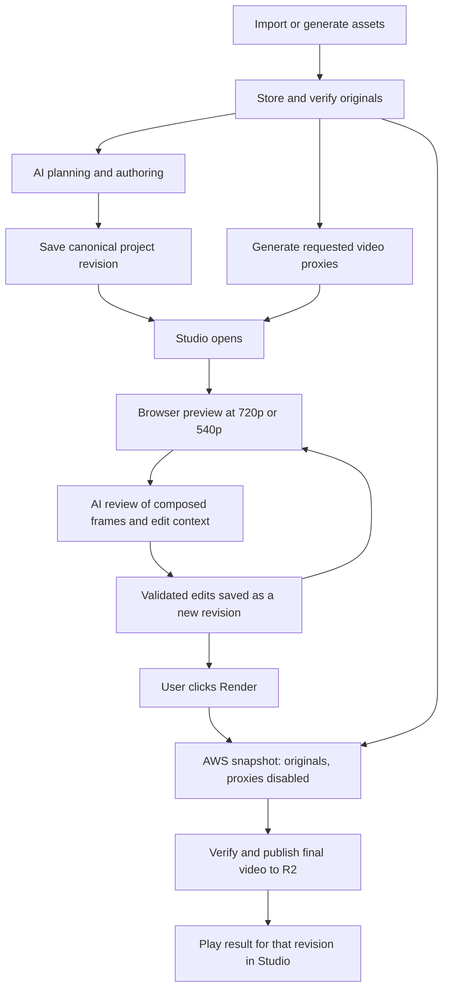

# EffectCraft asset, preview, AI review, and export workflow

Reviewed: 2026-10-08. Status: recommended implementation plan; not a deployed feature.

User decisions: screenshots may be at most **5 MB** and retain their original quality; Studio uses **540p or 720p** previews; final export uses original assets at the selected output resolution. Define 5 MB consistently as **5,000,000 bytes**. This limit applies to new screenshot uploads, not footage or existing saved screenshots.

## Recommendation

Use 720p by default in Studio, with a 540p performance option. Keep the canonical project at its final composition dimensions and timing. Lower the viewer's render resolution and attach smaller proxies to expensive video footage. These are separate optimizations: a smaller canvas reduces rendering work, while a smaller media proxy reduces download and decode work. Screenshots remain original assets, even when the composed preview frame is rendered smaller.

During initial creation, upload and preserve originals immediately. Do not make the user wait for Studio proxies before the AI can plan. Give visual AI tasks appropriately sized images or frames when needed. AI review should inspect the rendered composition, including the user's edits, rather than infer its appearance solely from source assets. Once the user clicks Render, export the saved revision with proxies explicitly disabled. Original files should already be in durable storage.

This recommendation applies to the proposed EffectCraft integration. The currently documented product uses HyperFrames; the local EffectCraft experiment and the upstream EffectCraft web app are different implementations. This document does not claim an EffectCraft AWS deployment exists or supersede the current deployed architecture.

## Evidence from the code

EffectCraft checkout inspected: `a6e6e2938c3f71062ea7653962186e726ab80237`. Findings are source review, not an end-to-end proxy benchmark.

| Finding | Evidence | Consequence |
| --- | --- | --- |
| Screenshot upload currently accepts up to 20,000,000 bytes and stores the uploaded bytes unchanged. It checks PNG/JPEG metadata, a 40-million-pixel decode limit and minimum width 640. | [Upload validation](../backend/src/projects/store.ts), `addScreenshot` | Implement 5 MB in the screenshot route, service and UI. Keep a pixel limit because compressed byte size does not bound decoded memory. Preserve existing projects. |
| The generic binary request parser currently allows 20,000,000 bytes. | [API server](../backend/src/server.ts) | Apply the new limit specifically to screenshots; lowering a shared parser could affect other upload routes. |
| The beat planner receives screenshot ID, name and purpose, then inserts them into a text prompt. | [Plan route](../backend/src/plan/routes.ts), [director](../backend/src/plan/director.ts) | This path cannot currently see screenshots or rendered edits. Visual review requires actual image content and a model adapter. This finding is specific to this planner. |
| User media is mirrored to R2 when R2 storage is configured; local files are a cache. | [Media adapter](../backend/src/media.ts) | Retain immutable original objects and add derived objects separately. Check deployed environment configuration before relying on this. |
| Render preparation copies selected screenshots and other inputs into a self-contained project. The worker downloads every object under the job prefix. | [Render preparation](../backend/src/plan/render-project.ts), [worker storage](../worker/src/storage.mjs) | Repeated renders currently transfer copies of inputs. A future manifest can reference verified immutable media objects directly. |
| The local EffectCraft editor requests PNG frames from a long-lived Docker MCP session; preview export uses half size. | [Experiment README](../experiments/gm-editor/README.md), [server](../experiments/gm-editor/server.py) | Half size is not always 540p or 720p. Moving this server unchanged to AWS adds network latency to each seek. |
| EffectCraft provides `file.setProxy`, `file.useProxy`, and render setting `proxyUse`. | [Proxy commands](../experiments/effectcraft/crates/engine/src/commands/proxy.rs), [render queue commands](../experiments/effectcraft/crates/engine/src/commands/render_queue.rs) | Use native proxy attachment rather than replacing a layer's original footage item. Set `on: true` explicitly; an omitted value toggles state. |
| The renderer scales proxy pixels into the original footage's nominal dimensions. Native tests check this and `UseNone`. | [Renderer](../experiments/effectcraft/crates/render/src/lib.rs), [proxy tests](../experiments/effectcraft/crates/engine/src/tests_proxy.rs) | Source dimensions and composition coordinates can remain stable across quality modes. These tests were read, not run in this review. |
| Render queue settings default to no proxies, but generic frame-render options default to current proxy settings. | [Queue model](../experiments/effectcraft/crates/project/src/render_queue.rs), [render options](../experiments/effectcraft/crates/render/src/lib.rs) | Enforce `proxyUse: "none"` explicitly for final jobs and original-quality QA frames. Do not infer asset quality from output dimensions alone. |
| The web build has browser storage, frame workers and project diff synchronization. It does not automatically upload projects to our backend. | [Web architecture](../experiments/effectcraft/docs/web.md) | Build explicit project/media synchronization and revision ownership around the web app. |
| Browser frame workers enumerate inputs through `footage_files`, which lists `ItemKind::Footage` originals and sequences but does not traverse attached proxies. | [Worker dispatch](../experiments/effectcraft/apps/effectcraft-web/src/frames.rs), [file enumeration](../experiments/effectcraft/crates/engine/src/offload.rs) | An attached proxy may never reach a worker unless also present as ordinary footage. Fix and test dependency collection before claiming browser proxy support works end to end. |

## Quality policy

| Stage / asset | Recommended behavior |
| --- | --- |
| Screenshot upload | Accept valid PNG/JPEG up to 5,000,000 bytes. Retain the original bytes. Show an explicit size error for larger uploads. Keep format, dimension and decode checks. |
| Initial planning | Start after required inputs are ready. No mandatory video proxy generation step. Provide metadata and, for visual tasks, a purpose-specific image representation. |
| Studio viewer | 720p default; 540p optional or adaptive during playback/dragging. Return to 720p when paused. Preserve the project's aspect ratio and never upscale smaller compositions. |
| Studio video footage | Reuse a 720p proxy, generating 540p only when required. Prefer a format tested in both EffectCraft web and native decoders. H.264 MP4 is a candidate for opaque footage, subject to those tests. |
| Studio screenshots, text, vectors, fonts | Use originals/native objects. Viewer resolution can be reduced without destructively resizing these inputs. |
| Transparent footage | Preserve alpha with a verified supported format. Ordinary H.264 MP4 is not an alpha-preserving substitute. |
| AI composition review | Start with 720p composed frames, scene/timestamp labels, exact text and structured edit context. Use original-detail crops for small text, masks, edges and zooms. |
| Final export | Selected final canvas dimensions, full render scale, original assets, matching fonts and engine version, proxies explicitly disabled. |

Define quality labels by orientation: landscape 16:9 is 1280×720 or 960×540; portrait is 720×1280 or 540×960; square is 720×720 or 540×540. For other aspect ratios, fit within the corresponding orientation's box, preserve aspect ratio and use codec-compatible dimensions. Do not change the saved composition dimensions to implement preview quality.

Proxies must preserve source duration, timestamp mapping, orientation, display aspect ratio and audio alignment. Preserve source frame cadence where supported; variable-frame-rate footage needs a verified timestamp mapping or an explicit normalized master. Never silently reinterpret timing. Include color conversion and alpha interpretation in the proxy recipe. Detailed keying, tracking, masks and color judgments may require original-quality frames even when normal playback uses a proxy.

## End-to-end workflow

### 1. Ingest once

Assign a stable asset ID and immutable original version/hash. Keep dimensions, duration, timestamps, rotation, color and alpha metadata. Start uploads when media is selected; for generated assets, persist the generator's output before advertising it as ready. Editing can use locally available files while upload completes. Final jobs wait for verified originals.

Use direct authorized uploads to R2 for large footage, with resumable multipart transfers. Small screenshots can retain the existing backend upload path initially. Only mark an object ready after validation; a multipart ETag is not a whole-file content hash. R2 supports direct uploads and multipart retry/resume behavior; see [upload documentation](https://developers.cloudflare.com/r2/objects/upload-objects/).

### 2. Plan and build before Studio

The first AI pass receives the brief, source metadata and readable visual references when the task depends on image content. If it needs only textual planning, skip image processing. Creating a visual AI input is independent of generating a Studio video proxy; neither requires modifying the original asset.

For screenshots, use the original when it fits the model's image constraints and is readable. Otherwise provide an overview plus labeled detail crops. Provider request limits, encoded size and pixel dimensions must be checked independently of the product's 5 MB upload limit. Save the dimensions and crop origin supplied to the AI so returned coordinates can map back into source coordinates.

Claude supports image inputs and recommends controlling image size while preserving text readability. Reusable file references can reduce repeated request payloads where the provider supports them. These are provider-specific capabilities; AWS rendering does not imply that AI calls use Bedrock. See [Claude vision guidance](https://platform.claude.com/docs/en/build-with-claude/vision).

### 3. Open Studio and resolve preview media

Request proxies only for footage actually needed by the current project. Generate once per original version and recipe; cache across revisions. A thumbnail or local file can appear while a proxy is prepared. Proxy generation itself takes time, so do not promise that the first Studio open is instant.

Prefer browser EffectCraft preview workers. Fix the input collector to include selected proxy files and sequence frames, including composition proxies where used. Make it mode-aware so original footage is not copied into every preview worker unnecessarily. Verify opening a project with only its proxy bytes present; native metadata and browser import/probing may still need integration changes. The current `addFile`/file-table workflow is not proof of streaming or lazy original downloads.

For a temporary AWS frame preview service, keep a persistent session and send only the newest requested frame at reduced size. Drop stale responses by revision and request ID. Reduced resolution helps payload size but does not eliminate the round trip. Do not launch a fresh container for each seek.

### 4. Let AI inspect edits

Render representative frames from the exact revision under review: a stable frame per scene, edited timestamps, and frames around relevant transitions. Submit these with layer IDs, exact text, source references and timing. For motion issues, use short frame sequences with timestamps; a still image cannot establish smoothness or audio sync.

Start reviews at 720p. Request targeted original-detail crops when needed, and reserve a small original-quality sample for final visual QA. Avoid reviewing the entire video frame by frame after every small edit. Reuse unchanged review inputs by revision and frame hash.

Apply AI changes as validated engine operations to a new revision. Use a bounded review loop (initial recommendation: at most two automatic correction passes), then report unresolved issues. AI feedback is advisory; proxy selection is deterministic and final rendering remains triggered by the user. Never regenerate or replace the original content merely to switch quality.

### 5. Render originals on AWS

Freeze the project revision, original asset versions, engine build, fonts and export settings. Validate that every required original exists. Build an isolated render snapshot with `proxyUse: "none"` and full scale. The existing CLI's normal render command builds a render queue item, but exposes no dedicated proxy-use flag in the inspected argument path; use the queue command/API to explicitly set and verify this policy, including when rendering a saved queue.

Initially a self-contained job package is acceptable. Later replace repeated media copies with a manifest of authorized immutable storage references, materialized at stable local paths by the worker. This requires worker permission and download-adapter changes; the current worker only reads its prepared uploads prefix. Cache originals by verified version when worker lifetime permits.

Upload and validate the result before marking the job ready. Associate it with the rendered revision so a completed old job does not replace a newer edit. Serve directly from storage with byte ranges and a playback-friendly MP4 layout. Show current job progress alongside the local preview.

## Data contract and failure behavior

Keep an asset manifest outside the `.ecproj` renderer-specific paths:

- `assetId`, owner/project association, original version/hash and immutable storage key.
- Source dimensions, duration/timebase, orientation, color and alpha metadata.
- Original status: uploading, verifying, ready or failed.
- Derived entries keyed by original hash + proxy recipe/version: dimensions, codec, timing mapping, hash, storage key and status.
- Mapping from asset ID to EffectCraft footage item ID and browser/worker virtual path.
- Export record containing project revision, selected original versions, engine version and quality settings.

Keep authoritative layout and timing in original composition coordinates. A new original creates a new asset version and invalidates its derivatives. Preview cache keys must also include revision, time, render scale, proxy version/mode and relevant engine settings. A missing proxy can trigger regeneration or an explicit original fallback. A missing original must prevent final export; never silently export the proxy. Upload retries and browser reloads must not lose the association between a saved edit and its assets.

## Implementation order and verification

1. Implement the 5 MB screenshot rule in backend validation, route handling and UI copy. Check exactly 5,000,000 bytes, one byte over, malformed images, large decoded dimensions and existing larger screenshots remaining usable.
2. Add original/derived asset metadata and immutable revision manifests through the project's normal storage process. Add direct resumable footage uploads when that upload surface ships.
3. Prove one native and one browser proxy case: different original/proxy dimensions, stable crop/anchor/transforms, proxies disabled on final export. Fix browser dependency enumeration; test proxy bytes available without the original bytes and inspect actual network/worker transfers.
4. Add lazy 720p proxy creation and 540p performance mode. Test portrait, square, transparency, video timing, audio sync and pause/seek behavior. Ensure screenshots and text remain original inputs.
5. Add visual AI input and composed-frame review, with coordinate mapping and stale-revision rejection. Test a small-text screenshot and an animated edit to ensure the review sees the changed composition.
6. Integrate the AWS EffectCraft job adapter and verify original-only exports. Compare representative final frames to original-quality browser frames; allow measured CPU/GPU tolerances rather than assuming identical pixels. Validate export duration, dimensions and audio timing.

Measure cold and warm Studio opening, bytes downloaded, proxy preparation time, p50/p95 seek-to-visible-frame latency, worker memory, AI request bytes and elapsed time, queue wait, asset fetch, render and output upload separately. Compare 540p and 720p on the same project, device and network. Reducing 1280×720 to 960×540 yields 43.75% fewer pixels; compressed byte size and render-time gains must be measured. Do not promise a fixed AWS export time until the actual worker and representative projects are benchmarked.

This review changes documentation only. The 5 MB rule, visual AI review, browser proxy transfer fix and AWS EffectCraft integration remain implementation work.
