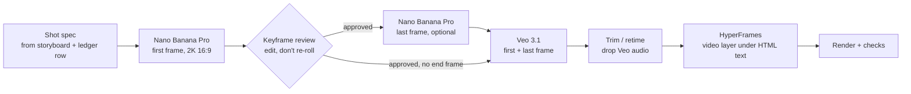

# Motion pipeline (potential plan): 2D in HyperFrames, 3D from Nano Banana + Veo

> **This is a potential plan, not a final decision.** It records the direction we are leaning towards after the 2026-10-04 tests. It becomes the plan only if the tests in §6 pass, and any part of it may change based on their results.

Proposed direction (2026-10-04): **2D motion graphics are the default** and are built entirely in HyperFrames.
When a video needs **3D**, Nano Banana Pro makes a polished still scene, Veo 3.1 animates it, and the
clip is placed as a video layer inside the HyperFrames timeline. We would stop hand-building 3D in
Three.js for customer videos.

**Status:** potential plan. The 2D path is proven in testing. The 3D path passed its first end-to-end test (T1, T3 and T5, on 2026-10-04: [`experiments/gm-ad-test/hybrid/`](../experiments/gm-ad-test/hybrid/), $2.81). T2, T4 and T6 are still open, so it is not yet approved for customers.

---

## 1. Why we are leaning this way (evidence from the 2026-10-04 tests in `experiments/gm-ad-test/`)

| Approach | What we saw | Verdict |
|---|---|---|
| HyperFrames 2D ([velocity sting](../experiments/gm-ad-test/velocity-sting/)) | 6/6 cuts verified continuous, `check` 0 findings, exact brand, 16s render (Mac) / 56s (2 vCPU Linux), $0 API | **Default for everything** |
| HyperFrames 3D in Three.js ([hyperframes/](../experiments/gm-ad-test/hyperframes/)) | Exact brand, but simple props, empty whip frames, 56s render that needs a GPU | Dropped for customer work |
| Nano Banana + Veo alone ([google/](../experiments/gm-ad-test/google/)) | Richest look, but garbled moving text in 2/7 shots, stock crossfades, loose timing, $17.36 | Use **only** for 3D shots, inside a HyperFrames film |

The split follows what each tool does reliably:
- **HyperFrames:** text, logo, brand colours, timing, transitions, music sync and editability.
- **Generative models:** materials, lighting and depth, which are expensive to build by hand.

## 2. Division of labour

| Element | Owner |
|---|---|
| All on-screen text, numbers, labels, captions | HyperFrames (HTML) |
| Logo and mark | HyperFrames, from the brand kit file. **Never generated** |
| UI and product screens | HyperFrames, rebuilt from real screens |
| Timing, cuts, transitions, seam ledger | HyperFrames |
| Music, SFX, voiceover mix | HyperFrames audio (sources: Lyria, Gemini TTS, licensed library) |
| 3D props, environments, materials, camera moves through a 3D world | Nano Banana Pro → Veo 3.1 |

## 3. The 3D shot pipeline



1. **Shot spec.** The storyboard gives each 3D shot its duration, the camera move, and the
   seam vector it must match on entry and exit (a `ledger.json` row). The shot prompt is written
   from that spec, so the generated camera agrees with the cuts on either side.
2. **First frame (Nano Banana Pro, `gemini-3-pro-image`).**
   - 2K, 16:9 or 9:16.
   - Pass the brand references: the logo or mark PNG for shape and colour, a palette swatch
     image, and up to 14 reference images in total.
   - The house style block from §4 goes in every prompt.
3. **Review gate.** A person (or Claude with vision) checks composition, brand colour, and that
   there is **no text and no logo** in the pixels. If it is 80% right, *edit* it with a follow-up
   instruction instead of regenerating; that is Google's own guidance and cheaper.
4. **Last frame (optional).** Use it when the shot has to land on a specific composition, such as
   a match-cut into the next scene or a hand-off to a HyperFrames element. Keep the horizon and
   vanishing point consistent with the first frame.
5. **Animate (Veo 3.1).**
   - Image-to-video from the first frame, or first + last frame interpolation.
   - The prompt uses the five-part formula from §4.
   - Use `veo-3.1-fast-generate-preview` for drafts and `veo-3.1-generate-preview` only for an
     approved final.
   - Constraint seen in testing: 1080p and first+last frame both produce **8s** clips, so a 2.5s
     shot wastes about 70% of what it pays for. See test T2.
6. **Trim and place.**
   - Cut the usable 2–3s. Retime by at most 1.5×; we saw clips sped up 4.3× feel rushed.
   - Veo's own audio can't be switched off in the API, so remove it.
   - Place the clip as a `<video>` with an `id`, with no 3D CSS ancestor, **under** the HTML text
     layer.
   - The seam into and out of the clip follows the same velocity-matching rules as 2D cuts.
7. **Chain for continuity.** When two 3D shots are consecutive, use the last frame of clip 1 as
   the first frame of clip 2. This keeps lighting, materials and camera position consistent.

### Rules
- **No generated text or logos, ever.** Prompt for clean surfaces, for example blank cards and
  unlabelled keycaps; HyperFrames adds the words. In our test Veo garbled moving text in 4 out of
  4 takes, even on the standard model.
- **Every generated asset is logged:** the model, the prompt file, cost, retry yes/no, and the
  source frame. Prompts are stored with the project so a shot can be regenerated.
- **Every video must still render** if a 3D shot fails. Each 3D slot has a 2D fallback.
- **Cost gate before Veo.** Keyframes are cheap; Veo is not. The customer, or the planner within
  plan limits, approves keyframes before any video is generated.

## 3b. Footage beats: people on screen (proposed, untested)

Character sheet (Nano Banana, approved once) → shot keyframe at the scripted camera angle (character sheet as identity reference) → Veo 3.1, with native lip-synced dialogue when the beat has a line → transcript check → HyperFrames pins the real UI onto the laptop screen and adds overlays. All prompts are written with visual-skills (`characters.md`, `de-slop.md`, `veo.md`, `camera-lighting-vocabulary.md`). Full rules: `gm-skill-authoring/references/script-for-motion.md` → Footage beats. Estimated cost: ~$0.40 per character sheet (once) + ~$1.10–1.50 per shot.

## 4. Prompt formulas

From Google's official guides ([Nano Banana](https://cloud.google.com/blog/products/ai-machine-learning/ultimate-prompting-guide-for-nano-banana),
[Veo 3.1](https://cloud.google.com/blog/products/ai-machine-learning/ultimate-prompting-guide-for-veo-3-1)),
adapted to our use.

**Nano Banana Pro, keyframe:** `[Subject] + [Action] + [Location/context] + [Composition] + [Style]`.
With references: `[reference images] + [relationship instruction] + [new scenario]`.

- **Be specific about materials.** Write "glossy white plastic keycap with soft clearcoat", not
  "keycap".
- **Light it like a director.** Write, for example, "large softbox key light from top-left, broad
  diffuse fill, soft contact shadows".
- **Name the camera and lens**, for example "35mm, slight low angle, shallow depth of field
  (f/2.8)".
- **Use positive framing.** Write "blank card surfaces", not "no text".
- **Give the why:** "keyframe for a product video; must leave clean space at the bottom third
  for a headline".

**House style block** (filled from the brand kit and appended to every keyframe prompt):

```
Bright, airy 3D studio; paper-white ({surface}) to pale sky ({canvas}) ground with a soft horizon.
Glossy white and soft-grey plastic props; satin {primary} on at most two objects; {accent} only
as a small forward wedge shape. Large softbox key light from top-left, broad fill, soft contact
shadows, gentle specular highlights. 35mm, shallow depth of field. Clean, premium, playful.
Surfaces are blank and unlabelled. 16:9.
```

**Veo 3.1, animation:** `[Cinematography] + [Subject] + [Action] + [Context] + [Style & ambiance]`.

- Name one camera move: dolly, tracking, crane, orbit, push, pan or truck. Give its direction
  and speed, and say that it must match the ledger row.
- For first + last frame, describe the transition itself: "the camera performs a smooth 90° arc
  to the right, ending exactly on the last frame".
- Use positive descriptions: "smooth continuous motion, surfaces stay blank".

## 5. Skills and tools

| Source | What it gives us | Decision |
|---|---|---|
| Google, [Ultimate Nano Banana prompting guide](https://cloud.google.com/blog/products/ai-machine-learning/ultimate-prompting-guide-for-nano-banana) | Official formulas, specs (1K/2K/4K, 10 aspect ratios, 14 references), editing guidance | **Source of truth** for keyframe prompts |
| Google, [Ultimate Veo 3.1 prompting guide](https://cloud.google.com/blog/products/ai-machine-learning/ultimate-prompting-guide-for-veo-3-1) | Five-part formula, camera vocabulary, first/last frame, ingredients-to-video, timestamp prompts | **Source of truth** for animation prompts |
| Google AI, [Nano Banana Pro prompting strategies](https://dev.to/googleai/nano-banana-pro-prompting-guide-strategies-1h9n) | "Edit, don't re-roll"; brief it like a human artist | Adopt |
| [smixs/visual-skills](https://github.com/smixs/visual-skills) (CC BY 4.0, 471★, markdown only) | `image` and `video` agent skills: cinematic direction plus exact prompt syntax for Nano Banana 2/Pro and Veo 3.1 | **Adopt after review.** Read it fully, vendor a pinned commit into `.claude/skills/` with attribution, and use it as the prompt-writing layer |
| [AntonioCardenas/generate-nanobanana](https://github.com/AntonioCardenas/generate-nanobanana) | A cost gate before paid runs; a prompt log beside every file | Borrow the pattern, not the code |
| [The-Focus-AI/nano-banana-cli](https://github.com/The-Focus-AI/nano-banana-cli) (MIT, 20★) | CLI and plugin for image, edit and Veo | Skip. No cost controls, defaults to Flash, and we already have tested scripts |
| Community "nano-banana-prompting" skills (openclaw, nikiforovall, giulioco, samurano) | Prompt rewriters with JSON templates and style detection | Reference only; the official guides plus visual-skills cover them |
| **Our own scripts** in [`experiments/gm-ad-test/google/scripts/`](../experiments/gm-ad-test/google/scripts/) | A working client (`gm.py`), keyframe and Veo generation, assembly, call logging. Tested request shapes (Veo frames must be `bytesBase64Encoded`; `inlineData` returns a 400) | **Promote** into a `gm-3d-shot` skill and later into the worker |

Third-party skills are read in full before vendoring. They are prompt text that our agents follow,
so they are treated like code review.

## 6. Tests (before customers)

| # | Test | Pass criteria | Est. cost |
|---|---|---|---|
| T1 ✅ | **Hybrid film.** 2D HyperFrames + two new Nano Banana → Veo shots | Seams verified on both sides; clip vs HTML ground within ΔE 5 **and no visible clip edge in `seams.jpg`**; `check` 0 findings | Passed after one fix (clip edge showed during the seam move). $2.81 for the whole test |
| T2 | **Clip length.** Veo at 4s / 6s / 8s at 720p and 1080p, with and without a last frame | A table of which combinations are allowed, and wasted seconds per shot | ~$3 |
| T3 ✅ | **Brand fidelity.** Keyframes with the mark and palette as references; then Veo animates around a blank space where HyperFrames puts the real logo | Brand colour within ΔE 10 of the token on the keyframe and through the clip | Passed: blue ΔE 5.5–7.9, orange ΔE 4.0–8.5; Veo drifts ≤ 1.6 ΔE. ΔE 5 is not reachable by prompting alone |
| T4 | **Continuity.** Chain two shots (last frame → first frame) | No visible jump in light or materials at the join | ~$3 |
| T5 ✅ | **Seam match.** A Veo camera move matching a ledger row (e.g. truck left at the cut) | Measured motion vector at the cut has the same axis and sign as the 2D side | Passed on both clips. Veo gets the direction right but moves 10–40× slower than the cut, so the HTML layer carries the speed |
| T6 | **Fallback.** Force a 3D shot to fail | The video still renders using the 2D fallback slot | $0 |


### Results so far (2026-10-04 hybrid test)

- **Time:** 6.4 min on the paid-generation path, including three keyframe review rounds. Both
  Veo jobs and Lyria ran in parallel, finishing in 97s; one Veo clip took 82–93s. The whole build
  took 28 min. CPU render of the 15s film: 98s on 4 vCPU, costing $0.005 on Railway.
- **Cost:** $2.81 = 6 Nano Banana Pro images ($0.81) + 2 Veo 3.1 fast clips ($1.92, both usable on
  the first take) + 1 Lyria song ($0.08). About **$1.40 per 3D shot**. 68% of billed Veo seconds
  were trimmed away, so T2 is now the biggest cost lever.
- **Failures seen and fixed:**
  - a keyframe came back as two stacked copies of the scene
  - Nano Banana added studio gear
  - it ignored "move the camera closer"
  - it drew the brand wedge pointing backwards
  - the brand droplet came out as a generic heart
  - Veo's grey → glossy change looked like a liquid "goo" sweep, usable but not premium
- **visual-skills:** rated 2/5, a small improvement. Keyframes weren't richer than plain prompts,
  but control was better: blank surfaces 6/6, and both Veo clips were usable on the first take.

### Rule changes from the test (apply to §3)

1. **Coverage:** a clip under a moving seam must cover the frame at every point of the move.
   Scale it up (~1.15×) rather than let its edge show.
2. **Push end frames:** make the last frame of a push with an exact centred crop of the first
   frame, not by asking Nano Banana to move the camera.
3. **Seam ownership:** ledger rows that touch a clip get a `veo_vector` field. Veo supplies the
   direction; the HTML layer supplies the speed across the cut. Trim past Veo's 2–3s
   start-from-rest ramp and measure each clip's motion before placing it.
4. **Hand-off sizing:** size any 2D element that hands off to a clip from the *measured* clip
   frame, not from the prompt.
5. **Prompt syntax:** drop lens and f-stop numbers from the house style block (visual-skills).
6. **Keyframe review checklist:** look for stacked or duplicated frames, studio gear, props
   facing backwards, and brand shapes that turned into generic icons. **Brand marks themselves
   are never generated**: if a shot needs the mark in 3D, use a supplied render or keep it in
   HyperFrames.
7. **Brand colour:** offer an optional per-clip colour correction when a brand needs tighter than
   ΔE ~6–8.

## 7. Costs (measured 2026-10-04, Gemini API list prices)

| Item | Unit price | Typical per 3D shot |
|---|---|---|
| Nano Banana Pro 2K keyframe | ~$0.135 / image | 2–3 images (first, last, one edit) ≈ $0.27–0.40 |
| Veo 3.1 fast, 1080p | $0.12 / s → $0.96 per 8s clip | 1–2 takes ≈ $0.96–1.92 |
| Veo 3.1 standard, 1080p | $0.40 / s → $3.20 per 8s clip | Finals only, if T3 shows fast isn't enough |
| **Per 3D shot** | | **≈ $1.25–2.30** (fast) |
| **Typical ad with 2 3D shots** | | **≈ $2.50–4.60** plus the 2D render |

A 2D-only video costs $0 in generation fees: just the Claude fill call (~$0.03–0.06) and render
compute.

## 8. Integration into the app (proposed, if the tests pass)

- **Planner (backend).** In fill mode the plan includes `shots[]`; each shot is `kind: "2d"` or
  `kind: "3d"`. A 3D shot carries its prompt fields (from §4), camera move, duration, ledger
  vector and a 2D fallback.
- **New queue `generate-3d-shot`, separate from `render-video`.** It mostly waits on Google, so
  it runs on a small, cheap service, not on render workers. Steps: keyframe → review gate → Veo
  → trim → upload to R2 → mark the asset ready.
- **Review gate in the UI.** At the Storyboard step, 3D shots show their keyframe with Approve /
  Edit / Use 2D instead. Veo only runs after approval, and each run counts against the plan's
  "3D shot credits".
- **Render.** The `render-video` job waits until every 3D asset is ready or has fallen back. It
  then renders as usual, since the clip is just a `<video>` in the composition.
- **Reuse.** Approved 3D clips are stored per brand kit in the Library, so the next video can reuse
  them at $0.
- **Logging.** Every generation call writes model, prompt, cost and asset ID, so cost per video
  is measured rather than estimated (`docs/STACK_DECISIONS.md` → cost model).

## 9. Effect on the skill library (if adopted)

- Style skills stay HyperFrames-first. A skill can declare `kind: "3d"` slots that the 3D pipeline
  fills; that is the only way 3D enters a film.
- `gm-glossy-3d-reel` (draft) is **on hold**. Its Three.js studio approach is replaced by this
  pipeline, so it is rewritten after T1–T5 pass.
- Next skill to author: `gm-3d-shot`. It takes a shot spec and produces a keyframe, a Veo clip
  and a placed video layer. It is built from our scripts plus the prompt formulas above, and
  authored with `/gm-skill-authoring`.
