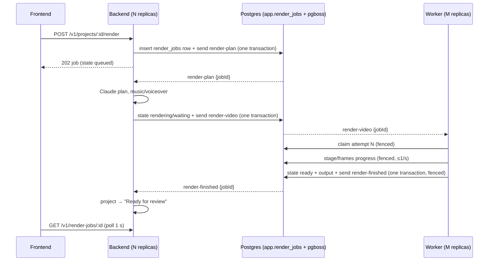

# Render queue

> Current implementation and live infrastructure: [Application, infrastructure and storage guide](SYSTEM_GUIDE.md). This document also contains historical plans; consult the guide and [release status](MVP_RELEASE_STATUS.md) for the October 8, 2026 production topology.

Date: 2026-10-04. Status: implemented and verified locally (JOB-01, local scope). Supersedes the synchronous `backend → POST worker:8080/renders` call.

## Why it changed

The worker rendered one video at a time and answered every other request with `503 draining: "Renderer is shutting down."`, even though it wasn't shutting down. The backend had no queue and no retry, so a second render started while one was running failed straight away with that misleading message. Render jobs also lived in backend memory, so a backend restart lost them.

Now every render is a durable row in Postgres plus a message on a pg-boss queue. A busy worker means *waiting*, not *failed*. Capacity grows by adding worker replicas, and a crashed or redeployed worker's job is retried on another replica without producing a duplicate result.

## Flow

## Queues

All defined in [`backend/src/jobs/queues.ts`](../backend/src/jobs/queues.ts). The backend creates and updates them at startup. Messages carry only `{ jobId }`, and consumers reload the row.

| Queue | Consumer | Retries | Expiry | Heartbeat | Dead letter |
| --- | --- | --- | --- | --- | --- |
| `render-plan` | backend (`PLAN_CONCURRENCY`, default 4 per replica) | 1, after 5 s | 600 s | 30 s | `render-plan-dead` |
| `render-video` | worker (`RENDER_CONCURRENCY`, default 1 per replica) | `RENDER_RETRIES` (2), backoff 10 s → 120 s | `RENDER_TIMEOUT_SECONDS` (900) | 30 s | `render-video-dead` |
| `render-finished` | backend | 5, backoff | default | — | — |
| `render-plan-dead`, `render-video-dead` | backend: marks the job failed, updates the project | 0 | — | — | — |

## Job row and states

Table `app.render_jobs` ([migration](../backend/src/db/migrations/001_render_jobs.sql)). The backend applies migrations at startup under a Postgres advisory lock, so replicas can start together.

| `state` | `stage` values | Written by | Shown in the UI as |
| --- | --- | --- | --- |
| `queued` | `queued` | backend | Writing the storyboard |
| `planning` | `planning`, `audio` | backend | Writing the storyboard; Making music and voiceover |
| `rendering` | `waiting` (+ `queuePosition`) | backend | Waiting for a renderer · "2 ahead" / "Next in line" |
| `rendering` | `preparing`, `frames` (+ `frames.done/total`), `encoding`, `retrying` | worker | Preparing composition; Rendering frames · 193 / 300; Adding audio and encoding; retry note |
| `ready` | `done` | worker | → Review opens |
| `failed` | `failed` | worker (permanent error) or backend (dead letter) | Render needs attention + Try again |

Frame counts come from parsing HyperFrames' own progress output (`62%  Streaming frame 202/300`). Nothing in the UI is simulated.

## Correctness rules

- **Atomic hand-offs.** The row change and the next queue message commit in one transaction, using pg-boss's `db` option with a transaction-bound client. There's never a job without a message, or a message without a job.
- **Idempotent consumers.** `beginPlanning` and `queueRender` only act on the expected state, so duplicate deliveries do nothing.
- **Fencing.** The worker's attempt is `retryCount + 1`. The claim sets `attempt`, and every later write requires `attempt = mine`. A stale attempt (heartbeat lost, worker frozen) can't write progress or a result. If it notices this mid-render, it kills its HyperFrames process group.
- **One file per attempt.** Output goes to `var/renders/<jobId>-a<attempt>.mp4`, and the row records which file won. A newer attempt deletes older attempts' partial files and HyperFrames `.hf-transaction-*` folders.
- **Permanent vs transient errors.** Bad inputs (missing brand kit, screenshot or audio) fail at once without retrying. Renderer errors retry with backoff. When retries run out, the dead-letter handler writes a user-facing message and keeps the technical detail in `error.detail`, which the API never returns.
- **Project sync.** `render-finished` only updates the project if `project.renderJobId` is still this job, so an older render can't overwrite a newer one's state. The render route saves the job id on the project *before* enqueuing.
- **Renderer-owned variables.** The worker still drops caller-supplied `logo` / `logoWordmark` and sets them only from `/brands/<id>`, so a plan or an edited row can't inject a logo.
- **Graceful shutdown.** On SIGTERM the worker stops taking jobs and waits up to `DRAIN_SECONDS` (25) for running renders. Anything still running is redelivered after its heartbeat lapses. The backend does the same for planning (20 s).

## Scaling

- Render throughput = worker replicas × `RENDER_CONCURRENCY`. Keep concurrency at 1 (one render ≈ 1 GB RAM, ~35–40 s for a 10 s video locally) and add replicas.
- Locally: `docker compose up -d --scale worker=3`. On Railway: `replicas` in [`.railway/railway.ts`](../.railway/railway.ts), held at 1 until MEDIA-02 and BRAND-02 land (see Known limits).
- Backend replicas share planning through `render-plan`; each runs `PLAN_CONCURRENCY` plans.
- Postgres connections: backend pool 10 + pg-boss 4 per backend replica; worker 4 + 4 per worker replica. On Supabase, use the **session** pooler URL (pg-boss needs session features).

## Known limits (next steps)

Tracked in the [Backlog](BACKLOG.md); order of work in [Progress](PROGRESS.md#next-actions-in-dependency-order).

| # | Limit | Backlog | Blocks |
| --- | --- | --- | --- |
| 1 | **No cancellation.** A started render can only finish or fail. The process-group kill it needs is already in place (`run(..., { signal })`). | JOB-03 (M3) | QA-01 "failed-job recovery", JOB-02 |
| 2 | **Shared disk for outputs.** Workers write `var/renders/<jobId>-a<n>.mp4` and the backend streams it from the same disk. | MEDIA-02 (M4) | More than one hosted worker replica; any hosted rendering |
| 3 | **Shared disk for inputs.** Workers read brand kits (`var/brands`) and generated audio (`var/audio`) that the backend wrote. | BRAND-02 | Branded or narrated renders on a hosted worker |
| 4 | **Worker uses the backend's database user.** It could read or change any table. | DB-03 (M4, before the worker gets a hosted `DATABASE_URL`) | Staging deploy of the worker |
| 5 | **Old jobs.** Jobs from before this change have no row; `GET /v1/render-jobs/:id` rebuilds them from the project and `<id>.mp4` (`recoveredRenderJob`). | — (remove after DB-01 migrates projects) | Nothing |

## Verification (2026-10-04, local)

| Test | Result |
| --- | --- |
| 3 renders submitted at once, 1 worker | All 3 `ready`. Queue positions 2 → 1 → 0, real frame progress, renders ran one after another (~126 s total). Before the change: 2 of 3 would fail with "Renderer is shutting down". |
| 2 renders, 2 worker replicas | Rendered in parallel. |
| `docker kill` one replica mid-render | Job redelivered after heartbeat loss, completed as attempt 2 on the other replica. Row points at `-a2.mp4`, no duplicate result. Found an orphaned HyperFrames transaction folder from the killed attempt → added cleanup of earlier attempts. |
| Planning failure (deleted brand kit) | Retried once, dead-lettered, job `failed` in ~10 s with "That brand kit no longer exists. Choose another kit and render again." |
| Project flow | Project went "Rendering draft" → "Ready for review" via `render-finished`; `renderJobId` matched. |
| MP4 serving | `GET /v1/renders/:id` → 200 `video/mp4` from the attempt file. |
