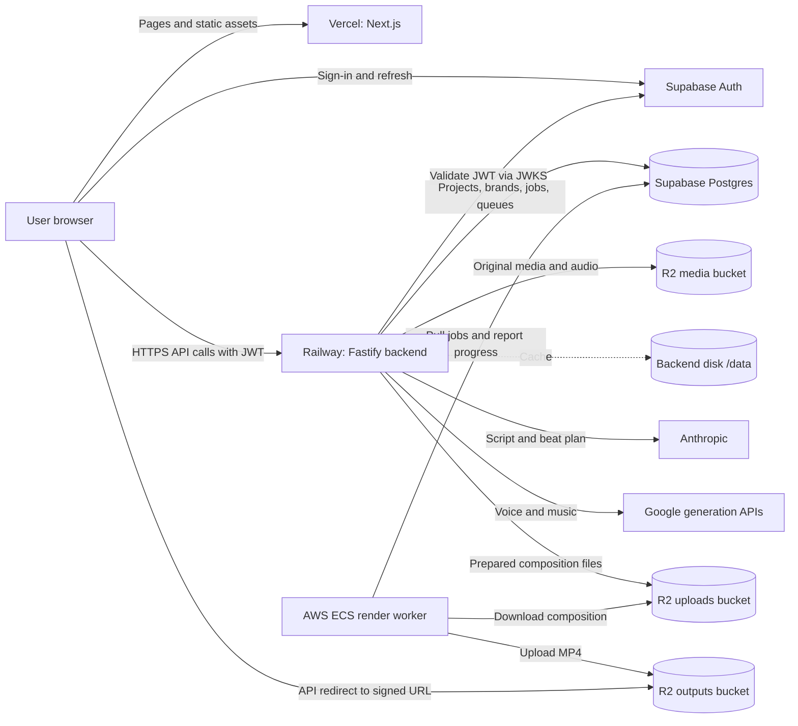
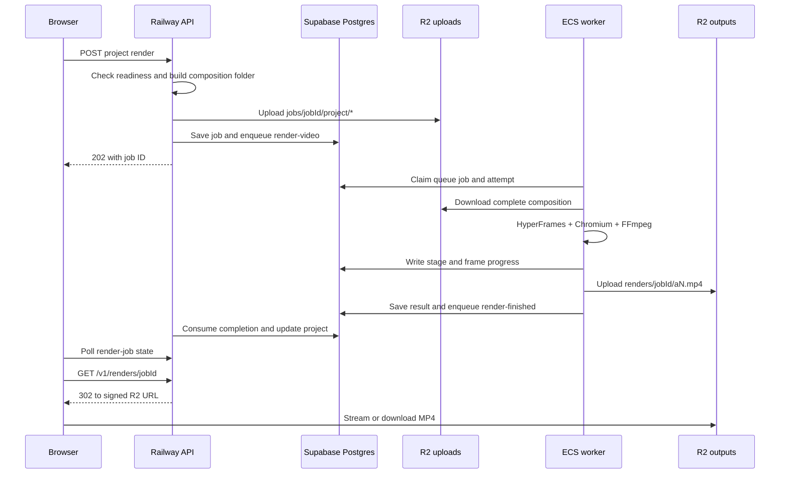

# Greedy Motion: application, infrastructure and storage guide

**Documented: October 8, 2026.** This is the current system map for developers and operators: what runs where, how a video is made, where records and files live, and how templates and presets reach the app.

**Scope and evidence.** Production facts below come from the October 8 rollout and its recorded live checks in [MVP release status](MVP_RELEASE_STATUS.md). The production application release is `c71ef78`; its worker image was built from `587d185`, whose worker code is identical to that release. Repository details were inspected on `main` at `bc62297`. Main contains additional creative tooling that was not promoted with the MVP; those differences are marked below. This document does not claim that every feature visible on main is deployed, or that cloud settings were audited again while writing it. **Fill-mode formats and the skill bundle (added 2026-10-08, [Skill delivery](SKILL_DELIVERY.md)) are on main only: not on staging or production.**

## Contents

1. [System at a glance](#1-system-at-a-glance)
2. [Live environments and resource names](#2-live-environments-and-resource-names)
3. [Repository map and service responsibilities](#3-repository-map-and-service-responsibilities)
4. [How a user creates a video](#4-how-a-user-creates-a-video)
5. [Complete storage inventory](#5-complete-storage-inventory)
6. [Database records, ownership and migrations](#6-database-records-ownership-and-migrations)
7. [Templates, presets, themes and fonts](#7-templates-presets-themes-and-fonts)
8. [AI prompts, skills and creative libraries](#8-ai-prompts-skills-and-creative-libraries)
9. [Rendering, queues and recovery](#9-rendering-queues-and-recovery)
10. [Authentication and media access](#10-authentication-and-media-access)
11. [Configuration and credentials](#11-configuration-and-credentials)
12. [Builds, deployments and local development](#12-builds-deployments-and-local-development)
13. [Operations, durability and known limits](#13-operations-durability-and-known-limits)
14. [Where to change something](#14-where-to-change-something)
15. [Source references and maintenance](#15-source-references-and-maintenance)

## 1. System at a glance

Greedy Motion turns a brief, screenshots and brand settings into a storyboard, an editable preview and a rendered video. The application has three deployable code units and two main storage systems, plus a persistent API volume.

| Part | Runs on | Owns |
| --- | --- | --- |
| Website and Studio | Vercel | Next.js pages, React interface, authentication screens, browser preview and editing |
| API and planning | Railway | Fastify API, authorization, project persistence, AI calls, media preparation and render orchestration |
| Video worker | AWS ECS Fargate | Queue consumption, HyperFrames, Chromium, FFmpeg, rendering progress and output upload |
| Authentication and database | Supabase | User identities/sessions, application records and pg-boss queues |
| Render object storage | Cloudflare R2 | Prepared render folders and finished MP4 files |
| Original media and generated working assets | Cloudflare R2 media bucket (`media/`), cached on the backend disk at `/data` | Screenshots, brand logos/fonts/CSS, site snapshots and generated audio. **Staging since 2026-10-08 (MEDIA-03); production still keeps them only on its volume until this release reaches it.** |
| Application source and reusable creative definitions | GitHub repository | Code, templates, theme presets, bundled fonts, prompt rules and deployment definitions |



The worker pulls work from Postgres. The API does not call a public worker HTTP endpoint. Supabase Storage is not the media store in this implementation. AWS ECR stores container images; Cloudflare R2 stores the rendered content, even though both use AWS-related tooling or API conventions.

## 2. Live environments and resource names

### Production and staging

| Resource | Production | Staging |
| --- | --- | --- |
| Git branch | `production` | `staging` |
| Vercel team | `greddy-motion` | `greddy-motion` |
| Vercel project | `greedy-motion` | `greedy-motion-staging` |
| Public frontend | https://www.greedymotion.com; apex `greedymotion.com` also assigned | https://greedy-motion-staging.vercel.app |
| Railway project | `lively-presence` | Same project, separate environment |
| Railway environment/service | `production` / `backend` | `staging` / `backend` |
| Public API | https://backend-production-1e413.up.railway.app | https://backend-staging-aec6.up.railway.app |
| Backend persistent mount | `/data`, production volume | `/data`, separate staging volume |
| Supabase project | `greedymotion-production` | `greedymotion-staging` |
| Supabase project reference | `bwwquxhexwyodsavsjar` | `ltaxhznuixoslbbcjkts` |
| Supabase URL | `https://bwwquxhexwyodsavsjar.supabase.co` | `https://ltaxhznuixoslbbcjkts.supabase.co` |
| Database connectivity | Supabase session pooler, `aws-0-ap-southeast-1.pooler.supabase.com:5432` | Same host, separate project credentials/database connection |
| R2 uploads bucket | `greedymotion-production-uploads` | `greedymotion-staging-uploads` |
| R2 outputs bucket | `greedymotion-production-outputs` | `greedymotion-staging-outputs` |
| AWS region | `ap-southeast-1` | `ap-southeast-1` |
| ECS cluster/service | `greedymotion-production` / `worker` | `greedymotion-staging` / `worker` |
| ECR repository | `greedymotion-production-worker` | `greedymotion-staging-worker` |
| Recorded task definition | `greedymotion-production-worker:1` | `greedymotion-staging-worker:2` |
| Worker CloudWatch log group | `/ecs/greedymotion-production-worker` | `/ecs/greedymotion-staging-worker` |

The Railway project ID is `5298f20e-3531-44a5-a32e-7b99b0cb5b09`; the backend service ID is `df6c5746-6c6e-4275-897d-75bb0cd6370b`. Environment IDs are `2f57bf5f-a2db-4b65-98bc-c8d12d120149` for production and `07084322-b9de-41c1-8bd0-225ffa063faf` for staging. Always scope operations to the environment as well as the service.

### Production AWS layout

The worker runs in AWS account `369904858685`. Its image registry is `369904858685.dkr.ecr.ap-southeast-1.amazonaws.com`. At release, the service had one healthy ARM64 Linux Fargate task, 2 vCPU, 4 GB RAM and `RENDER_CONCURRENCY=2`.

The task is placed in public subnets in VPC `vpc-0219d4dcb5841cbf4`, with a public IP for outbound access and a security group with **no inbound rules**. It needs outbound access to Supabase, R2, ECR, Secrets Manager and logging services. Its local port 8080 provides a container health endpoint; it is not a public application API.

The identities have different jobs:

- `greedymotion-production-worker-deployer`: deployment/provisioning CLI identity used during rollout.
- `greedymotion-production-worker-exec`: ECS execution role; pulls the image, emits logs and loads Secrets Manager values.
- `greedymotion-production-worker-task`: runtime task role. The running container does not need the deployer's access keys.

The release enabled the ECS deployment circuit breaker and rollback. Production CloudWatch retention was configured to 30 days. Provisioning policy templates exist in `infra/aws/policies/`; their existence does not establish which policies are currently attached to an IAM identity.

## 3. Repository map and service responsibilities

| Directory/file | Role | Where its contents execute or appear |
| --- | --- | --- |
| `frontend/app/` | Next.js routes, layouts and application CSS | Vercel and browser |
| `frontend/components/` | Landing page, auth, Studio, storyboard and editor UI | Browser, with Next.js rendering |
| `frontend/lib/api.ts` | Typed API calls and access-token attachment | Browser |
| `frontend/utils/supabase/` and `frontend/proxy.ts` | Supabase clients, session refresh and route protection | Browser and Vercel |
| `frontend/public/` | Site branding, UI fonts and generated gallery previews | Vercel static delivery |
| `backend/src/server.ts` | API registration, preview/media endpoints and startup | Railway backend |
| `backend/src/auth.ts`, `access.ts` | JWT validation and per-user ownership checks | Railway backend |
| `backend/src/projects/store.ts` | Project document persistence and screenshot handling | Railway backend + Supabase + `/data` |
| `backend/src/brand/` | Brand extraction, upload validation, font handling and brand records | Railway backend + Supabase + `/data` |
| `backend/src/site/` | Product website reading, optional browser capture and snapshots | Railway backend |
| `backend/src/plan/` | Director, beat-plan editing, preview, audio, timing, readiness and composition assembly | Railway backend |
| `backend/src/render/` | Render-job repository, legacy planner and queue consumers | Railway backend |
| `backend/src/jobs/queues.ts` | Queue definitions and retry settings | Railway backend; persisted in Postgres |
| `backend/src/pro/` | Pro Editor store: open a project into an editable HyperFrames folder, revisioned file writes, lint, low-res or final render, preview frame (main only; [Pro Editor](PRO_EDITOR.md)) | Railway backend + `/data` cache + R2 media |
| `backend/src/formats/` | Fill-mode formats: bundle verification, slot validation, model fill, render-folder builder, `/v1/formats` routes (main only) | Railway backend |
| `backend/skills/author/` | Pinned stage-routed references for Claude Pro Editor proposals, hash-verified at startup | Copied into the backend image with `backend/` |
| `backend/skills/` | The gm-* skills the app can run, built from `.claude/skills` by `npm run skills:build`, hash-verified at startup (main only) | Copied into the backend image with `backend/` |
| `backend/src/db/` | Connection pool, SQL migrations and row locking | Railway backend + Supabase |
| `backend/src/storage.ts` | R2 render-input upload and signed output URLs | Railway backend |
| `worker/src/worker.mjs` | Worker lifecycle and job execution | ECS Fargate; Docker locally |
| `worker/src/compose.mjs` | HyperFrames invocation and legacy template preparation | Render worker |
| `worker/src/jobs.mjs` | Job claims, fenced writes and completion | Render worker + Supabase |
| `worker/src/storage.mjs` | Download render inputs, upload outputs, clean losing attempts | Render worker + R2 |
| `worker/templates/`, `themes/`, `fonts/` | Reusable rendering source assets | Copied into backend and worker images |
| `packages/contracts/src/` | Shared types, validators and catalogs | Frontend/backend; supporting generation scripts |
| `.claude/skills/` | Authoring instructions, selected prompt sources and creative formats. `BUNDLE.json` lists the skills shipped to the app | Developer tools; selected rules compiled into the backend (director prompt) and listed skills bundled into it (`backend/skills/`) |
| `third_party/cloud-author-skills/` | Reviewed upstream skill references, licenses, URLs and commit provenance for the cloud bundle | Built into `backend/skills/author/` |
| `third_party/creative-packs/`, `third_party/visual-skills/` | Reference material and provenance | Development/authoring; not automatically part of the live UI |
| `scripts/` | Theme, prompt, preview, format and validation generators | Developer machine or applicable CI job |
| `validation/` | Fixtures, render experiments and verification artifacts | Development/CI |
| `infra/aws/` | Worker provisioning, deployment scripts and IAM/task templates | Operator CLI and AWS |
| `.railway/railway.ts` | Earlier proposed Railway IaC layout | Reference; not an exact declaration of the live AWS-worker topology |
| `.github/workflows/` | Branch-triggered CI and Supabase migration workflow | GitHub Actions |
| `supabase/config.toml` | Supabase CLI/local configuration | Local tooling; not automatic proof of remote settings |
| `compose.yaml` | Local Postgres and worker containers | Docker Desktop/local Docker |
| `var/` | Local runtime files | Developer disk, ignored by Git |
| `docs/`, `design_handoff/` | Documentation, product decisions and design references | Development documentation |

The root npm workspace contains `frontend`, `backend` and `packages/contracts`. The worker has its own package manifest and lockfile, installed separately inside its image. TypeScript backend files execute on Node; the repository uses the `pg` driver and SQL directly, rather than the Drizzle-based architecture described in some early plans.

## 4. How a user creates a video

### Sign-in and project creation

The browser loads the site from Vercel. `/auth` handles sign-in and account creation; `/auth/callback` completes the auth callback; `/auth/reset` handles password reset. `/studio` and `/app` are protected application entry points in the production release.

After authentication, the browser calls the Railway API with a Supabase bearer token. Creating a project inserts a row in `app.projects`. The row contains the durable project document, including its brief, selected template/theme, screenshots' metadata, storyboard, audio metadata, review comments, editor state and current render reference as those features are used.

### Main API entry points

| Route | Responsibility |
| --- | --- |
| `GET/POST /v1/projects` | List owned projects / create a project |
| `GET/PUT /v1/projects/:id` | Load/update a project |
| `POST /v1/projects/:id/screenshots` | Upload validated image bytes |
| `POST /v1/projects/:id/site` | Read a product website and save available inputs |
| `POST/PATCH /v1/projects/:id/plan` | Generate/edit the beat plan |
| `POST /v1/projects/:id/plan/audio` | Generate requested plan audio |
| `GET /v1/projects/:id/composition` | Obtain composition/preview information |
| `PATCH /v1/projects/:id/studio` | Persist editable template values and selected assets |
| `POST /v1/projects/:id/render` | Validate and queue a project render |
| `/v1/projects/:id/pro/*`, `/v1/preview/projects/:id/pro/@<token>/*` | Pro Editor open, files (409 on a stale revision), lint, render, preview frame; needs `PRO_USER_IDS` (main only, see [Pro Editor](PRO_EDITOR.md)) |
| `GET /v1/formats` | List the shipped fill-mode formats and their slot schemas (main only) |
| `POST /v1/formats/:skill/render` | Fill a format's slots (caller facts + model-written copy), validate, build and queue a render (main only) |
| `GET /v1/render-jobs/:id` | Read authorized render status |
| `GET /v1/renders/:id` | Redirect to the output or serve a local file |
| `GET/POST /v1/brands` | List/create brand kits |
| `PUT /v1/projects/:id/approve` | Save approval state |
| `/v1/projects/:id/comments` and related routes | Store review feedback and apply supported revisions |

The API registration files are authoritative for methods, payloads and error handling; this table is a navigation aid, not a full API schema.

### Collecting inputs

A user can upload screenshots and select or create a brand kit. Screenshot bytes are sent to the backend, validated/normalized, then written to its persistent volume. Their IDs, names and attributes are saved in the project document.

Brand settings are saved in `app.brand_kits`; logo and font files are written to the backend volume. A website URL can also supply product facts and brand suggestions. The site reader uses a browser when one is available and falls back to HTML-only extraction otherwise. The backend Dockerfile does not install Chromium, so hosted section screenshots should not be assumed available merely because capture code exists. The release smoke test used uploaded screenshots.

### Planning and editing

The Script & Style brief contains the user's problem or own script, duration, aspect ratio, motion profile, pace, captions, audio mode, brand and selected screenshots. `POST /v1/projects/:id/plan` calls the backend director, which asks Anthropic for a structured beat plan and validates it. The plan and corresponding script are saved on the project.

The browser renders the backend-generated HyperFrames composition through `@hyperframes/player`. Storyboard edits update the saved beat plan; template editor changes save values and screenshot selections through the API. Zustand/Zundo keeps a limited in-memory undo history for editor values and assets. It is not the durable project database, and its history is not an account-wide saved revision log.

### Audio and readiness

When requested, the backend produces voiceover and music before rendering. Voice takes are cached by inputs such as text, voice and delivery settings; music is cached separately. Their files live on the volume, with references and timing in the project document. The configured audio integration uses Gemini TTS and Lyria. Audio support exists in code; production release acceptance did not exercise it.

`backend/src/plan/readiness.ts` checks the plan, required audio, timing and duration before accepting a storyboard render. An invalid or incomplete storyboard returns a user-facing readiness error rather than starting an unusable render.

### Preparing, rendering and downloading



The prepared composition includes everything the worker needs. No shared Railway/AWS filesystem is required. The rendered video becomes available when its output upload has succeeded and the winning job attempt has committed completion.

## 5. Complete storage inventory

### Durable records and files

| Item | Authoritative location | Paths or record fields | Writer / reader |
| --- | --- | --- | --- |
| User identities, password hashes, provider identities and sessions | Supabase Auth | Managed `auth` schema | Supabase Auth |
| Projects, briefs and approved copy | Supabase Postgres | `app.projects`, full document in `data` JSONB | Backend / backend |
| Beat plans, storyboard edits and suggestions | Supabase Postgres | Project `data.brief`, `data.beatPlan`, script-related fields | Backend director/editor routes / preview and rendering |
| Saved template values and screenshot selections | Supabase Postgres | Project `data.studio` | Backend Studio route / browser and render preparation |
| Review comments and approval state | Supabase Postgres | Project document and `state` column | Backend / browser |
| Screenshot metadata and site facts | Supabase Postgres | Project `data.screenshots`, `data.site` | Backend / planning and preview |
| Screenshot image bytes | Railway volume | `/data/projects/<projectId>/screenshots/<screenshotId>.png` or `.jpg` | Backend / preview and render-folder builder |
| Captured website sections | Railway volume, when browser capture succeeds | `/data/projects/<projectId>/site/section-<n>.html`; screenshots use the normal screenshot directory | Site reader / backend |
| Brand name, colors, font choices and other metadata | Supabase Postgres | `app.brand_kits.data` | Backend / picker, preview and planner |
| Saved brand logo and generated theme/font CSS | Railway volume | `/data/brands/<brandId>/logo.png`, `theme.css`, `fonts.css`, `fonts/*` | Brand service / preview and render-folder builder |
| Original brand logo copy | Railway volume where supported | `/data/brands/<brandId>/logo-original.png` | Main's newer brand implementation; not part of initial MVP production code |
| Pending brand assets | Railway volume | `/data/brands/_staging/<assetId>.<format>` and `<assetId>.json` | Brand upload/extraction service |
| Per-project generated voice/music | Railway volume | `/data/audio/plans/<projectId>/vo/*`, `music/*` | Backend audio service / preview and render-folder builder |
| Legacy per-job generated audio | Railway volume | `/data/audio/<jobId>/music.wav`, `voiceover.wav` | Legacy backend planning path |
| Audio timing, takes and generation metadata | Supabase Postgres | Project `data.planAudio`; legacy render revision where applicable | Backend / timing and preview |
| Product-facing render-job state | Supabase Postgres | `app.render_jobs` | Backend and worker / backend polling API |
| Queue messages, retry/heartbeat state | Supabase Postgres | `pgboss` schema | pg-boss in backend and worker |
| Applied backend SQL migration history | Supabase Postgres | `app.schema_migrations` | Backend migration runner |
| Prepared render folder | R2 uploads bucket | `jobs/<jobId>/project/*` | Backend / worker |
| Winning and intermediate output attempts | R2 outputs bucket | `renders/<jobId>/a<attempt>.mp4` | Worker / browser through signed URL |
| Output object key and video metadata | Supabase Postgres | `app.render_jobs.output` | Worker / backend |
| Container image | AWS ECR | Environment-specific worker repository and version tag/digest | Docker push / ECS pull |
| Live app configuration and API secrets | Vendor configuration stores | Vercel, Railway, Supabase Auth settings, AWS Secrets Manager | Operator / relevant runtime |
| Worker runtime logs | CloudWatch | `/ecs/greedymotion-<environment>-worker` | ECS logging / operator |
| Backend and frontend logs | Railway and Vercel | Platform deployment/runtime logs | Runtime / operator |

**The R2 bucket named `uploads` is a render-transfer store.** Original user media lives in the separate **media bucket** (`greedymotion-<env>-media`, set by `R2_MEDIA_BUCKET`). Every media write goes through `backend/src/media.ts`, which writes the file to the local directory and to R2 under `media/<projects|brands|audio>/<same path>`; every read fetches a file the local disk lacks back from R2. The `/data` rows in the table above are therefore the **cache layout**; the durable copy is the same path under `media/` in R2. Copies of the inputs a particular render needs still go to that render's folder in the uploads bucket.

Status: staging runs this (all 7 existing volume files backfilled and MD5-verified with `scripts/backfill-media.ts`; files deleted from the volume came back byte-identical through the public routes). Production setup remains pending: deploy the media release with `greedymotion-production-media` and scoped credentials, then verify fresh uploads and recovery. **2026-10-09: no retained user media; backfill intentionally skipped.** See [MEDIA-03 production setup](MEDIA_R2_ROLLOUT.md) for the external prerequisites and rollout. Old release-test media is disposable. The two-replica gate remains open because existing cache files are not revalidated after another replica updates or deletes them.

### Production filesystem layouts

The configured backend directories are `PROJECTS_DIR=/data/projects`, `BRANDS_DIR=/data/brands`, `AUDIO_DIR=/data/audio` and `RENDER_OUTPUT_DIR=/data/renders`. These correspond to local defaults under `var/`.

```text
Railway persistent volume
/data/
  projects/<projectId>/
    screenshots/<screenshotId>.png|jpg
    site/section-<n>.html
  brands/
    _staging/<assetId>.<format>
    _staging/<assetId>.json
    <brandId>/logo.png
    <brandId>/theme.css
    <brandId>/fonts.css
    <brandId>/fonts/*
  audio/plans/<projectId>/
    vo/*
    music/*
  renders/<jobId>/project/       temporary composition before upload

R2 uploads bucket
jobs/<jobId>/project/
  index.html
  variables.json
  vendor/gsap.min.js
  fonts/*
  brand-fonts/*                 when applicable
  brand/logo.png               when applicable
  shots/*
  audio/vo/*
  audio/music/*
  sfx/*

R2 media bucket (durable; mirrors the /data layout above)
media/projects/<projectId>/screenshots/*, site/*
media/brands/<brandId>/*, media/brands/_staging/*
media/audio/plans/<projectId>/vo/*, music/*

R2 outputs bucket
renders/<jobId>/a1.mp4
renders/<jobId>/a2.mp4          if a later attempt is needed
```

Optional files depend on the project. In R2 mode, the backend removes its temporary render folder after upload. The worker downloads the folder to `/tmp/render-<jobId>-a<attempt>/project`, renders to scratch `out.mp4`, uploads it and removes that scratch directory in a `finally` block. Scratch space is disposable, not a backup.

The worker cleans up losing output attempts using its storage adapter. There is no verified comprehensive expiration policy for every prepared input folder, original upload, staged brand asset and final output. Do not assume those are all automatically removed after a fixed period.

### Things that are not durable project storage

Browser undo history, API in-memory serialization maps, worker scratch directories and build caches are temporary. `frontend/public/` contains distributable application assets, not private customer files. Old project/brand JSON import files may remain locally, but Postgres is the current authority for their records.

## 6. Database records, ownership and migrations

### Tables

| Table/schema | What it contains | Important behavior |
| --- | --- | --- |
| `app.projects` | `id`, `owner_id`, `name`, `state`, full `data` JSONB, timestamps | The full project is stored as JSONB while indexed columns support filtering and listing |
| `app.brand_kits` | `id`, `owner_id`, `name`, `data` JSONB, creation time | Files are referenced by the record, not embedded as binary data |
| `app.render_jobs` | Project/owner references, state/stage/progress, attempt, frame counts, request, revision, render input, output, error and timestamps | Durable rendering state survives API/worker restarts |
| `app.schema_migrations` | Migration filename and application time | Backend migrations applied once |
| `pgboss.*` | Internal queue tables | Managed by pg-boss; worker connects with migration disabled |
| `auth.*` | Authentication records | Managed by Supabase |

Project, brand and render-job records have RLS enabled by migration `003_projects_and_brand_kits.sql`. Authenticated read policies use ownership; project-linked render access also checks the owning project. The API separately enforces ownership and returns 404 for another user's resources. The backend's direct database role can have broader privileges, so RLS is not a replacement for API authorization.

Ownership is currently by Supabase user ID. Team/workspace membership, an `app.templates` user-template table and immutable revision-history tables described in older plans are not established parts of this release. Nullable owners support historical imports; `LEGACY_OWNER_ID` controls adoption/visibility of those records.

Project read-modify-write operations use a row lock and a transaction through `withRowLock`. This prevents concurrent API edits and render completion updates from silently overwriting one another's project fields.

The project/job/brand relationships are represented by IDs and document references. The inspected migrations do not add foreign keys with cascading deletion for these references. Deleting an Auth user or one metadata row should therefore not be treated as a complete media-and-project cleanup operation.

### Two migration mechanisms

The active application schema lives in `backend/src/db/migrations/`:

1. `001_render_jobs.sql`: durable render jobs.
2. `002_render_job_owner.sql`: initial render ownership column.
3. `003_projects_and_brand_kits.sql`: project/brand records, owner updates and RLS.

The backend applies these at startup, serializes migration execution with a Postgres advisory lock and records completed filenames. pg-boss owns its queue schema separately.

There is also `.github/workflows/supabase-migrate.yml`, which runs `supabase db push` on matching branch changes to `supabase/**`. It skips if the environment's required GitHub secrets are absent. At the inspected main revision, there is no `supabase/migrations/` directory. This workflow is distinct from the backend's startup migration runner; do not assume adding SQL under one system executes it through the other.

## 7. Templates, presets, themes and fonts

### What each term means

A **template** supplies scene structure and renderable composition code. A **theme** supplies palette, typography and style tokens. A **motion profile** and **pace** influence planning and timing. A **look** controls the drawing treatment where implemented. A **brand kit** is user-owned data and media that overrides the generic branding. A **skill** is authoring or planning guidance and may include a development template, but it is not automatically a selectable product template.

### Exact locations

| Item | Source of truth | Generated/runtime copies | Saved user selection |
| --- | --- | --- | --- |
| Four starter-template definitions | `packages/contracts/src/templates.ts` | Bundled into frontend/backend | Project render request and Studio data in Postgres |
| Starter-template compositions | `worker/templates/<templateId>/index.html` and assets | Backend `/app/worker/templates`; worker `/app/templates` | Template ID in project |
| Beat-plan engine | `worker/templates/beat-plan/engine.js` with `build.mjs` | Generated `index.html`, copied into images and prepared render folders | Structured project beat plan |
| Theme/palette presets | `packages/contracts/src/themes.ts` | `worker/themes/<themeId>.css` from `scripts/build-themes.ts` | Theme ID in request/brief |
| Motion and pace options | `packages/contracts/src/beat-plan.ts` | Planning, timing and engine implementations | Brief's `motionProfile`, `pace` and plan motion values |
| Duration and aspect options | `packages/contracts/src/beat-plan.ts` | Validated brief and composition canvas/timing | Project brief and plan |
| Voice options | `packages/contracts/src/audio.ts` | UI selector and backend audio calls | Brief/audio metadata |
| Audio modes and caption modes | `packages/contracts/src/beat-plan.ts` | Planning and preview/render preparation | Project brief |
| Look catalog, main only for the added Sketch feature | `packages/contracts/src/looks.ts` | Main's UI/backend and generated engine | Main's brief `look` field |
| Bundled rendering fonts | `worker/fonts/*.woff2`, `fonts.css`, `LICENSE.md` | Backend and worker images; copied into prepared render folder | Theme/brand font references |
| Bundled sound effects | `worker/templates/beat-plan/sfx/` | Backend preview and prepared render folder | Beat plan/timing chooses effects |
| Gallery images | `frontend/public/templates/`, `frontend/public/themes/` | Vercel static assets | No customer record needed |
| Public design asset copies | `frontend/public/assets/` | Vercel static assets | Presentation assets only |
| Product logo/mascot | `frontend/public/brand/`; design masters in `docs/brand/` | Vercel | Independent of a customer's brand kit |
| User brand presets | `app.brand_kits` plus `/data/brands/<brandId>/` | Derived CSS/logo/fonts copied into render folder | `brandId` in request/brief |
| Developer-authored reusable format, main only | `.claude/skills/gm-velocity-sting/template/` and `references/` | `scripts/build-format.mjs` writes a chosen output folder | Not a production user-template database |

Templates and presets are **versioned source assets in Git**. They are not fetched as a mutable template catalog from Supabase or R2 at runtime. A particular job's assembled copy does go to R2, but the underlying reusable template remains part of the application release.

### Starter templates and the newer planning path

The catalog contains `product-launch`, `feature-spotlight`, `stat-highlight` and `whats-new`. Their original compositions are fixed 10-second, 1920×1080 templates with declared variables and scenes.

The newer Script & Style path uses the shared `beat-plan` engine, with project-specific structured beats, selected aspect ratio and duration. `beat-plan` is an engine template rather than a fifth starter-gallery entry. The brief supports 16:9, 9:16 and 1:1, duration validation from 10 to 120 seconds, and duration presets of 15, 30, 45, 60 and 90 seconds. This explains why the app can produce a 15-second film even though the four starter compositions are 10 seconds long.

The Script & Style selector also names `gm-feature-explainer` and `gm-glossy-3d-reel` planning structures. Those identifiers guide the director; their labels do not prove that a separate production rendering engine or third-party reference pack has been deployed.

### Theme and option inventories

The 16 theme IDs are:

`neutral`, `bold`, `editorial`, `biennale-yellow`, `blockframe`, `blue-professional`, `bold-poster`, `broadside`, `capsule`, `cartesian`, `cobalt-grid`, `code-editorial`, `coral`, `creative-mode`, `daisy-days`, `editorial-forest`.

Each theme defines color, font, radius, spacing and motion tokens. Some originate from HyperFrames frame presets, but the app's checked-in TypeScript catalog and generated CSS are the runtime definitions. `worker/themes/CONTRACT.md` describes the token contract.

Other preset values are defined in code:

- Motion profiles: `snappy`, `smooth`, `springy`.
- Paces: `calm`, `balanced`, `fast`.
- Audio modes: `voiceover`, `music`, `both`, `none`.
- Caption modes: `key-phrases`, `full`, `none`.
- Script modes: `problem`, `own`.
- Voice IDs: `Kore`, `Puck`, `Charon`, `Aoede`, `Fenrir`, `Leda`; default `Kore`.
- Main's look catalog: `clean` and `sketch`; paper/clay/other generated-image looks remain planned.

There is no current general-purpose customer “save as preset” service demonstrated by these catalogs. Saved project settings and reusable brand kits provide persistence; developer presets remain in code.

### How asset changes ship

Edit the catalog and implementation together. `npm run themes:build` regenerates theme CSS; `npm run previews` produces gallery assets using the worker; `npm run templates:verify` checks starter-template declarations. The beat-plan engine uses `node worker/templates/beat-plan/build.mjs`, with generated output committed alongside its source.

Backend Docker builds copy `worker/templates`, `worker/themes` and `worker/fonts` into `/app/worker/`. Worker Docker builds copy the `worker/` directory into `/app/`. Vercel bundles frontend catalog imports and serves `frontend/public/`. A template change may therefore require **backend, frontend and worker releases**, depending on which assets changed. Pushing a new template to one service alone can leave catalog, preview and renderer versions inconsistent.

## 8. AI prompts, skills and creative libraries

Anthropic calls originate in the backend. The director in `backend/src/plan/director.ts` generates structured beat plans; the earlier planner remains in `backend/src/render/anthropic-planner.ts`. The worker has no model-generation responsibility and is not supplied an Anthropic/Gemini key by the task definition.

The director's rule text is compiled by `scripts/build-director-prompt.mjs` into `backend/skills/director/`. Its inputs are:

- `.claude/skills/gm-skill-authoring/references/script-for-motion.md`
- `.claude/skills/gm-skill-authoring/references/watchability.md`
- `.claude/skills/gm-script-director/references/routing.md`
- `.claude/skills/gm-script-director/references/motion-direction.md`

Run `npm run skills:build` after editing those sources. The verified Markdown ships in the backend image. Copying another Markdown file into `.claude/skills/` does not automatically send it to Claude at runtime. Authoring-only text in those sources is fenced with `<!-- director:skip -->` markers so it never reaches the director.

**Skills that run in the app (main only).** A skill listed in `.claude/skills/BUNDLE.json` is packaged by `npm run skills:build` into `backend/skills/` (template, slot schema, fill guidance, pinned vendor files, hashed manifest). The backend verifies the bundle at startup and serves it through `/v1/formats`: the caller supplies product facts, Claude writes the remaining slots, the slot schema validates everything, and the finished folder goes to the same render queue and worker as any other render. CI fails if the bundle or the director prompt is stale (`npm run skills:check`). Author mode (an agent building a new composition) is not hosted. Details, API, release steps and test evidence: [Skill delivery](SKILL_DELIVERY.md).

Third-party creative packs live under `third_party/creative-packs/`; provenance and notices are in that directory and `third_party/creative-libraries-NOTICE.md`. Main also contains library experiments under `validation/creative-libraries/` and dependency mapping in `scripts/creative-vendor.mjs`. GSAP is part of the established rendering path; main adds Sketch/Rough.js integration and other creative-library experiments. The additional main code and velocity-sting tooling were not in production `c71ef78`.

The backend's current source default is `ANTHROPIC_MODEL=claude-sonnet-4-6`, overridable by environment configuration. The release tests reported `claude-opus-5-5` on staging and `claude-sonnet-4-6` on production. Source defaults do not guarantee that environments use the same model. Gemini TTS and Lyria model identifiers likewise live in their backend integration files and should be checked there when changing providers.

## 9. Rendering, queues and recovery

There are two render paths:

- **Prepared beat-plan path:** validate and assemble the saved storyboard in the backend, upload its files, then enqueue `render-video` directly. The worker renders the supplied composition.
- **Legacy starter-template path:** enqueue `render-plan`; a backend consumer plans values and audio, then passes work to `render-video`. Filesystem-dependent legacy behavior should not be assumed to have the same hosted R2 coverage as the tested beat-plan path.

| Queue | Consumer | Purpose |
| --- | --- | --- |
| `render-plan` | Backend | Legacy asynchronous planning/audio preparation |
| `render-video` | Worker | Produce MP4 |
| `render-finished` | Backend | Synchronize the project's completed render state |
| `render-plan-dead` | Backend | Convert exhausted planning failures into a saved failed state |
| `render-video-dead` | Backend | Convert exhausted rendering failures into a saved failed state |

There is no Redis queue or separate message-broker service in this topology. Messages carry job IDs; consumers load inputs from `app.render_jobs`. Application-visible states are `queued`, `planning`, `rendering`, `ready` and `failed`; stages distinguish waiting, frame rendering, encoding and other steps. Frame counts come from HyperFrames progress output.

The worker claims an attempt number. Subsequent progress and completion writes are fenced by that number, so a stale attempt cannot replace a newer attempt's result. Output keys include the attempt. Row transitions and queue hand-offs use transactions where implemented, including completion notification.

Default backend settings are planning concurrency 4, render queue timeout 900 seconds and 2 render retries. Worker concurrency defaults to 1 in source; the deployed production task definition sets 2. Do not confuse queue expiry, process shutdown grace and any legacy timeout environment names: an example variable only has an effect if the active code reads it.

The worker stops taking new jobs on SIGTERM and drains for `DRAIN_SECONDS` (25 at release). Expired/failed work is retried through pg-boss. Product-level render cancellation is not implemented as a complete user workflow.

## 10. Authentication and media access

Supabase manages passwords, provider login and sessions. The frontend uses Supabase SSR/browser clients; Vercel's proxy refreshes session cookies and validates claims for protected page entry. API requests use bearer tokens, and `backend/src/auth.ts` verifies signature, issuer and audience against the configured project's JWKS.

`backend/src/access.ts` checks project, brand and render-job ownership after authentication. Lists filter by the user. References to another user's brand are also checked. The release exercised cross-user project listing, read, update and render requests with temporary accounts.

**Media routes authenticate with a media token instead of the Bearer header** (staging since 2026-10-08; production until it receives this release still serves them open by id). Image, iframe and video elements cannot send a header, so these GET routes accept `?t=<media token>`:

- `/v1/preview/projects/*`, `/v1/preview/plans/*`, `/v1/preview/brands/*`
- `/v1/renders/<id>`
- `/v1/projects/<projectId>/screenshots/<screenshotId>`
- `/v1/brands/<brandId>/logo`
- `/v1/brands/assets/<assetId>/preview`

The token (`GET /v1/media-token`, `backend/src/media-links.ts`) names the user and an expiry 12–13 hours ahead, signed with `MEDIA_URL_SECRET`. The usual ownership check then runs, so a link only opens its owner's media, and only until the token expires; a forged or expired token is a 401. The backend writes the token into the private asset URLs of the preview pages it serves. Only shared files with no user data stay open: `/v1/preview/runtime.js`, `gsap.js`, `fonts/*`, `templates/*/assets/*`, `plan-sfx/*`. The rendered-video route then redirects to an R2 URL presigned for 3,600 seconds.

Production CORS permits the www and apex `greedymotion.com` origins. Auth callbacks are configured in the corresponding Supabase project. Resend SMTP and Google provider settings belong to Supabase Auth configuration; email delivery, password-reset delivery and the Google consent flow were not validated by the MVP release smoke test.

## 11. Configuration and credentials

| Location | What belongs there | What must not be inferred |
| --- | --- | --- |
| Vercel project/environment variables | `NEXT_PUBLIC_API_URL`, `NEXT_PUBLIC_APP_ENV`, `NEXT_PUBLIC_SUPABASE_URL`, `NEXT_PUBLIC_SUPABASE_PUBLISHABLE_KEY` | `NEXT_PUBLIC_*` values are browser-visible, not server secrets |
| Railway backend variables | Database URL, auth/project settings, CORS, model keys, R2 credentials, storage paths and queue settings | Setting them does not update an already-built frontend bundle |
| Supabase project settings | Auth providers, callback URLs, SMTP, database/platform settings | Local `supabase/config.toml` is not a complete read-back of live configuration |
| AWS Secrets Manager | Worker database URL and R2 key pair | Worker secrets do not contain model keys or user sessions |
| ECS task definition | Image reference, CPU/memory, environment names, bucket names, secret references, logging, health probe | It should reference secrets rather than embed secret values |
| Local ignored env files | `frontend/.env.local`, `backend/.env`, `worker/.env`; operator credential files where needed | Example files contain placeholders and may describe older topology |
| GitHub environment secrets | Credentials used by workflows that require them | A committed workflow does not prove those secrets or branch protection rules are configured |

Production worker secret names are:

```text
greedymotion/production/worker/database-url
greedymotion/production/worker/r2-access-key-id
greedymotion/production/worker/r2-secret-access-key
```

Staging uses the same pattern with `/staging/`. The execution role reads those values when ECS starts a task. Secret changes need a new task to pick up the new values.

`infra/aws/production-aws.mjs` reads the ignored `infra/aws/.env.production.csv`, requires restrictive file permissions and injects the credentials into an AWS CLI child process. `infra/aws/deploy-worker.sh` currently loads local operator env files and is explicitly set to **staging**. It is not a generic production deploy command. Other local operator credential sources used by the existing scripts are the ignored root `.env.credentials` and `infra/aws/.env`. They are setup/deployment inputs, not files baked into the application images. Credential values are intentionally excluded from this guide.

Startup validation checks supported environment/auth/storage values, required database/model/R2 configuration, optional expected Supabase project matching and production CORS requirements. Bucket naming conventions help isolation, but the current `config.ts` does not itself verify every bucket name ends with the environment name; correct values still need to be set operationally.

## 12. Builds, deployments and local development

### Hosted deployment flow

GitHub hosts `motionfxfrenzy/greedy_motion`. `main` is the integration branch. Promotion goes through `staging`, then `production`, with the selected release verified before the production merge. Main can contain later work that is intentionally excluded from a promotion.

Vercel has separate projects, each building its assigned branch, with frontend root directory `frontend`. The staging project's Vercel **Production** environment serves the product's staging site; Vercel's environment label and the application's environment are different concepts. Production's public variables are compiled into its build, so changing an API URL requires a frontend rebuild.

Railway builds the backend from the repository root with `backend/Dockerfile`, because it needs contracts and rendering source assets. Each Railway environment follows its corresponding branch and uses its own variables and persistent volume.

The AWS worker is released separately: build the worker image from the selected source, push it to the environment-specific ECR repository, register/update the task definition and update ECS. The inspected GitHub workflows do not establish an automatic worker release on every Git push. A production branch push alone should not be assumed to update ECS.

Main's `.github/workflows/ci.yml` defines type/catalog checks, database ownership checks and creative render checks. That CI addition is newer than the MVP production code. On main it also runs `npm run skills:check` (skill bundle and director prompt freshness) and the format builder test. Check workflow presence on the target branch and actual run results before claiming a release is gated by it.

### Local topology

| Component | Local address/path |
| --- | --- |
| Frontend | `http://localhost:3000` |
| Backend | `http://localhost:4000` |
| Docker Postgres | Host `127.0.0.1:55432`, container `postgres:5432` |
| Worker health | Port 8080 inside the container; no default host port |
| Original files | `var/projects`, `var/brands`, `var/audio` |
| Render working/output files | `var/renders` |
| Persistent local database | Docker named volume `postgres-data` in the Compose project |

`compose.yaml` mounts `var/renders` at `/renders` in the worker, and brands/audio/projects at `/brands`, `/audio`, `/projects` read-only. The local filesystem adapter therefore shares files, unlike hosted R2 transfer. The optional Supabase CLI stack uses its own ports (such as 54322); that is separate from the Compose Postgres on 55432.

Typical commands from the repository root:

```sh
npm ci
docker compose up -d --build worker
npm run dev:backend
npm run dev:frontend
```

Copy and fill the app-specific env examples first. AI planning requires an Anthropic key unless `PLANNER=deterministic` is explicitly chosen for local use. `AUTH_MODE=none` is accepted only for local operation; hosted environments require Supabase authentication. Local frontend authentication can still point at a configured remote Supabase project, so inspect local values before assuming all development data is local.

## 13. Operations, durability and known limits

### Health and logs

| Symptom/check | Where to inspect |
| --- | --- |
| Frontend build/page errors | Vercel deployment and runtime logs |
| API availability | `/healthz`; database connectivity through `/readyz` |
| Upload fails with EACCES | Railway `/data` ownership and write permissions |
| Planning fails | Railway backend logs, model key/model configuration and saved API error |
| Render remains waiting | pg-boss queue, ECS desired/running tasks and worker DB connectivity |
| Render fails after starting | Worker CloudWatch logs, job attempt/stage/error and prepared R2 input folder |
| Video does not download | `app.render_jobs.output.key`, outputs bucket object and backend R2 signing configuration |
| Brand loses logo/font | Brand row plus corresponding `/data/brands/<id>` files |
| Auth redirects to the wrong site | Supabase Site URL/redirect list and Vercel public environment values |

The production volume had to be assigned to UID/GID 1000 (`node:node`) during release. That corrected a real screenshot-upload failure. A new or restored volume needs compatible permissions too.

Railway's service API read-back reported `/readyz` and timeout 120 seconds, while deployment metadata still reported a null healthcheck path. Live readiness was verified, but automatic deployment gating was not conclusively established. The distinction is retained in the release report.

### Durability and recovery boundaries

A complete application recovery needs the database and the R2 buckets (media and outputs), plus a compatible source/image release and configuration. Where MEDIA-03 is deployed (staging), the backend volume is only a cache: losing it costs re-downloads, not data. Where it is not yet deployed (production until release), the original media volume is still a third requirement: a database backup alone cannot restore a missing uploaded logo or screenshot.

| Loss/restart | What survives | What may be lost or unavailable |
| --- | --- | --- |
| Browser refresh | Backend-saved project and media | Unsaved local edits and undo history |
| Backend process restart | Postgres records, persistent `/data`, R2 objects | In-memory work coordination; operations depend on retry/error handling |
| Worker task replacement | Queue/job records and already uploaded R2 objects | In-progress scratch files; retry handles recoverable interrupted jobs |
| Railway volume loss | Postgres metadata and existing R2 render copies/outputs | Original images, brand files, audio caches, site snapshots |
| R2 object loss | Project/job metadata and originals still on Railway | Prepared inputs and/or completed download objects |
| Database loss | Existing media objects/files | Ownership, project documents, queues and mappings needed to use them |

The document records storage locations, not a verified backup service-level agreement. Backup/PITR entitlements, Railway volume backup schedules, R2 retention/lifecycle rules and restore drills require separate verification.

### Current constraints

- Keep the backend at one replica while original media and per-project work coordination rely on its volume and in-memory maps.
- Worker scaling consumes both memory and database connections. Backend defaults use up to 10 application connections plus the pg-boss pool; each worker uses an application pool of 4 plus a pg-boss pool of 4.
- The worker's deployed database secret was sourced from the production database connection. A separately restricted worker database role was not implemented during this release.
- Public media routes have the link-based behavior described above; private object buckets do not make every application media route authenticated.
- Hosted website browser capture is conditional; uploaded screenshots are the verified production input path.
- Voice/music generation and email/Google auth flows were not included in release acceptance. The verified render used audio mode `none`.
- Checkout remains disabled. Billing, workspace collaboration, saved user-template tables and Sentry integration mentioned in plans are not documented here as completed infrastructure.
- More code exists on main than on production. In particular, Sketch, brand-file restoration, creative-library CI and developer format tooling need separate promotion/validation.

## 14. Where to change something

| Desired change | Start here | Deployment/data impact |
| --- | --- | --- |
| Landing page or public navigation | `frontend/components/landing-page.tsx` | Frontend rebuild/deploy |
| Studio interface | `frontend/components/studio.tsx`, `studio-editor.tsx`, `script-style.tsx` | Frontend; contracts/API too if data shape changes |
| API URL or public Supabase project | Vercel environment variables | Rebuild frontend; match backend CORS/auth environment |
| Add a starter template | `packages/contracts/src/templates.ts` + `worker/templates/<id>/` | Verify declarations, regenerate previews, align backend/worker/frontend versions |
| Change template animation | Template HTML or beat-plan `engine.js` + its build script | Regenerate engine where applicable; release matching render assets |
| Add or adjust a theme preset | `packages/contracts/src/themes.ts` | Regenerate theme CSS/previews; deploy consumers |
| Change offered duration, aspect, pace or motion options | `packages/contracts/src/beat-plan.ts` | Match frontend, director, validation and engine behavior |
| Change user branding | Brand API/store and saved brand kit | Postgres metadata and volume assets; future renders use the selected kit |
| Change voice options/provider | `packages/contracts/src/audio.ts`, backend audio/plan files | Backend/provider configuration and frontend catalog |
| Improve director instructions | Four prompt source files in section 8 | Regenerate `backend/skills/`; backend deploy |
| Add a reusable developer format | `.claude/skills/<skill>/template/` + slot/ledger references | Main's `scripts/build-format.mjs`; requires product integration to become a live user option |
| Make a format run in the app, or change one that does | Skill folder, then list it in `.claude/skills/BUNDLE.json`; `npm run skills:build` and `node scripts/build-skill-bundle.mjs --gates` | Backend image only (the worker is unchanged); [Skill delivery](SKILL_DELIVERY.md) has the release steps (main only) |
| Move original media off Railway | Projects/brand/audio/site storage implementations | Data migration and URL/read-path changes; existing files must remain reachable |
| Change database schema | `backend/src/db/migrations/` for current app runner | Compatible forward migration, staging first |
| Increase render capacity | ECS service/task configuration and DB connection budget | More tasks/concurrency; measure memory and queue time |
| Change worker secrets | Environment-specific AWS Secrets Manager values | Roll tasks to load changes |
| Diagnose one job | `app.render_jobs`, CloudWatch, `jobs/<id>/project/*`, `renders/<id>/*` | Read before retrying or deleting anything |

## 15. Source references and maintenance

Primary implementation references:

- [Backend configuration](../backend/src/config.ts), [API routes](../backend/src/server.ts), [authentication](../backend/src/auth.ts), [ownership](../backend/src/access.ts).
- [Project store](../backend/src/projects/store.ts), [brand store](../backend/src/brand/store.ts), [site routes](../backend/src/site/routes.ts), [database runner](../backend/src/db/database.ts).
- [Plan readiness](../backend/src/plan/readiness.ts), [render-folder builder](../backend/src/plan/render-project.ts), [plan audio](../backend/src/plan/audio.ts), [queue definitions](../backend/src/jobs/queues.ts).
- [Backend R2 adapter](../backend/src/storage.ts), [worker](../worker/src/worker.mjs), [worker job handling](../worker/src/jobs.mjs), [worker R2 adapter](../worker/src/storage.mjs).
- [Template catalog](../packages/contracts/src/templates.ts), [theme catalog](../packages/contracts/src/themes.ts), [brief/beat contracts](../packages/contracts/src/beat-plan.ts), [voice catalog](../packages/contracts/src/audio.ts).
- [Backend Dockerfile](../backend/Dockerfile), [worker Dockerfile](../worker/Dockerfile), [local Compose](../compose.yaml), [AWS task template](../infra/aws/policies/worker-taskdef.json).
- [Production release evidence](MVP_RELEASE_STATUS.md), [authentication/data detail](AUTH_AND_DATA.md), [creative library plan](CREATIVE_LIBRARY_PLAN.md), [skill delivery](SKILL_DELIVERY.md), [skill library](SKILL_LIBRARY.md), [Remotion vs HyperFrames](REMOTION_VS_HYPERFRAMES.md).
- [Format routes](../backend/src/formats/routes.ts), [bundle verification](../backend/src/formats/bundle.ts), [slot validation](../backend/src/formats/slots.ts), [skill bundle builder](../scripts/build-skill-bundle.mjs).

Older [architecture](ARCHITECTURE.md), [deployment](DEPLOYMENT.md), [environment](ENVIRONMENTS.md), [queue](RENDER_QUEUE.md) and [template](TEMPLATES.md) documents contain useful design history but also outdated statements. Examples include “nothing deployed,” a Railway-hosted renderer, disk-only hosted outputs, production coming-soon status, no audio and proposed workspace membership. Use this guide and the release record for current topology, and source code for implemented behavior.

Update this guide whenever a promotion changes service placement, a storage path, a schema, template distribution, access control or environment names. Record the exact deployed commit/task revision and distinguish source-code capability from a verified live workflow.

### Skill delivery revision — October 9

Director, formats and author references now share one `backend/skills/manifest.json` and loader. `cloud-author/stages.json` controls ordered stage sources. Explicit stages bypass the Claude classifier; IDs never steer routing. Pro edits have two validation repairs and static seek warnings. See [Skill delivery](SKILL_DELIVERY.md) for the current build/release contract. No deployment was performed.
