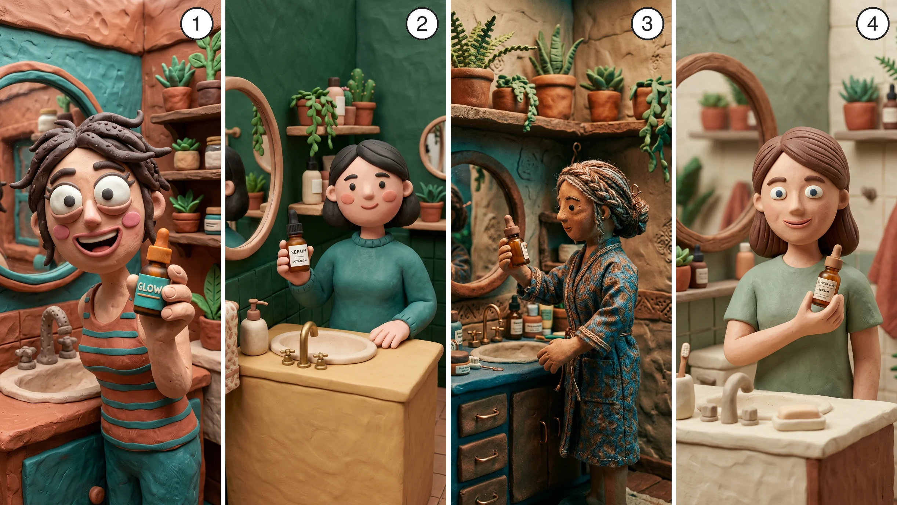

# claymation SKILL

The claymation visual style for AI video ads. Every image made under this skill exists to be animated: a start frame, beat reference, or hero reference for a video draft - one beat of the ad, visualizing what the voiceover says at that moment. Two things make the output win: every frame must read as **photographed physical clay** (fingerprints or tool marks, soft clay sheen, real cast shadows - or the model drifts into a smooth CGI render), and every frame must be a **self-contained scene shot from inside the miniature clay world**.

## Scope

This is solely a visual rendering style, nothing more. It never drives scene content - the storyboard belongs to the ad; this skill only decides how the world is sculpted, lit, and animated. Plan the ad first (script, then the voiceover as the pacing source, then the storyboard), and apply this skill at the prompting steps. The style suits voiceover + B-roll content best.

## What makes anything read as clay (apply to every sub-style)

1. **Visible making-marks** on every surface - fingerprints and thumb smudges (goofy, puppet) or refined tool marks (clean, premium). A clay world with no trace of hands reads as CGI.
2. **Soft clay materiality** - matte-to-satin plasticine sheen, slight subsurface warmth; never write "smooth," "polished," or "glossy" - those words trigger the CGI drift.
3. **Clay imitations for hard materials.** Glass, liquid, metal, and flame are clay's hardest cases - describe them as "sculpted as a professional clay imitation of [an amber glass dropper bottle / pouring water / a brass kettle]" and they hold.
4. **Handmade geometry** - each lane sets how wonky or refined, but nothing is factory-perfect.
5. **Real cast shadows and physical lighting** - the scene is lit like a real miniature set.
6. **Stop-motion cadence in motion** - stepped 12fps judder, no motion blur (motion section below).

## The camera lives inside the miniature clay world

Every image is a still the video model will animate, so it is a self-contained scene: the clay world extends past every edge of the frame and the camera sits inside it at a named angle. Unlike paper, clay tolerates - and gains charm from - miniature-scale cues when they come from the lens: macro feel and shallow depth of field read as a stop-motion film set, not an exterior view. Never show set edges, workbench, or the room around the set.

## Image model (tested)

Clay images default to **Nano Banana 2**: from testing, its clay outputs are notably more creative and truer to the style than GPT Image 2's, which came out flatter and less suited to claymation - GPT Image 2 remains a viable option to test when a look isn't landing. Seedream 4.5 can also be a great model for very creative output and is worth trying on demanding briefs. When a result misses, reroll on Nano Banana 2 before rewriting the prompt: variance, not the prompt, is usually the cause once a lane's block is locked.

## Sub-style menu (pick one per video; name it to the user)

Pick by content fit, or use the one the user names. One sub-style per video - the locked style block opens every image and video prompt in that video, verbatim. A lane's character design language (eyes, proportions, hair treatment, geometry energy) is part of the style and stays fixed; the character's identity (face, outfit, coloring) is free per ad and holds via hero references.

**The four styles, side by side** - one identical scene in each, numbered:



Pick your style by number:

1 = Goofy claymation · 2 = Clean simple clay · 3 = Stop-motion puppet · 4 = Premium studio plasticine

Once picked, that sub-style's block opens every image and video prompt in your video, word for word. Want a different kind of claymation? Describe it, then build your own style block from the clay fundamentals above and lock it the same way.

### 1. Goofy claymation (googly lane)

- **Design language:** oversized head; huge round googly cartoon eyes - white sclera, small dark pupils, thick sculpted lids; bold sculpted eyebrows; round blush-pink clay cheeks; wide open-mouthed grin; hand-sculpted clay hair, neatly shaped with a few playful strands out of place. Wonky handmade geometry - nothing perfectly straight; busy, cluttered sets; visible fingerprints everywhere.
- **Best for:** playful brands, comedic beats, high-energy hooks.
- **Style block:** `Goofy claymation scene - everything sculpted from plasticine with visible fingerprints and thumb smudges, wonky handmade geometry where nothing is perfectly straight, saturated teal and terracotta palette, the scene filling the entire frame with the camera inside the clay world.`
- **Character block (any goofy character):** `a goofy plasticine [person] with an oversized head, huge round googly cartoon eyes - white sclera, small dark pupils, thick sculpted lids - bold sculpted eyebrows, round blush-pink clay cheeks, a wide open-mouthed grin, and hand-sculpted clay hair, neatly shaped with a few playful strands out of place`

### 2. Clean simple clay (soft matte lane)

- **Design language:** smooth-matte rounded forms with subtle tool marks, simple dot eyes, gently exaggerated cartoon proportions, tidy compositions.
- **Best for:** minimal brands, calm explainers, beats where the product should out-detail the world.
- **Style block:** `Polished claymation scene - everything sculpted from smooth matte modeling clay, clean rounded forms with soft even surfaces and subtle tool marks, gently exaggerated cartoon proportions, refined handcrafted stop-motion feel, the scene filling the entire frame with the camera inside the clay world.`

### 3. Stop-motion puppet (mixed-craft lane)

- **Design language:** clay figures detailed with tiny real craft materials - thread-wrapped hair, fabric scraps, wire-rimmed glasses, button details - on fully sculpted clay sets; cinematic film lighting, moodier palettes (deep teal shadows, warm amber light).
- **Best for:** story-driven ads, darker or more cinematic tones, premium narrative feel.
- **Style block:** `Stop-motion clay puppet scene - clay characters detailed with tiny craft materials: thread-wrapped hair, fabric details, wire accents, on a fully sculpted clay set, cinematic stop-motion film lighting with gentle shadows, the scene filling the entire frame with the camera inside the puppet world.`

### 4. Premium studio plasticine (refined lane)

- **Design language:** matte plasticine with refined intentional craftsmanship - subtle tool marks, controlled texture, never messy fingerprints; natural proportions; neatly sculpted hair with fine comb grooves; bright friendly eyes with white sclera and colored clay irises (irises are what keep this lane from collapsing into dot-eyes); softly sculpted lips; macro lens feel with shallow depth of field; soft diffused light with gentle rim glow; slight subsurface warmth; rich harmonious palettes.
- **Best for:** premium brands, hero product beats, the sophisticated default.
- **Style block:** `Premium studio claymation scene - everything sculpted from matte plasticine with refined intentional craftsmanship: subtle tool marks, controlled texture, soft rounded geometry, slight subsurface warmth, macro lens feel with shallow depth of field, soft diffused studio lighting with a gentle rim glow, the scene filling the entire frame with the camera inside the miniature clay world.`
- **Character block:** `a plasticine [person] with natural proportions, neatly sculpted hair showing fine comb grooves, bright friendly eyes with white sclera and colored clay irises, softly sculpted lips in a warm smile`

## Prompt rules

- **Style block first, verbatim** - then the scene. Consistency comes from the block plus hero references, never "same style as before."
- **Weave the clay into every element.** Name the material treatment on each major object - "a clay serum bottle sculpted as a professional clay imitation of an amber glass dropper bottle," "a coiled clay towel," "clay plants with thumb-pressed leaves" - not just in the block.
- **Explicit palette in every prompt.** Saturated and high-contrast by default; premium runs rich harmonious (sage/cream/terracotta family); puppet runs cinematic (deep shadows, warm practicals).
- **Camera inside the world, named angle** - "camera at eye level, inside the scene"; macro + shallow depth of field is the premium lane's native look.
- **The product stays accurate.** Attach the hero product reference whenever the product appears; describe it as a clay imitation of its real form so the label and silhouette hold.
- **Tasteful whimsy lives in the rendering.** Enrich craft details - quilling-like coils, pressed textures, tiny sculpted props - but the beat's content comes from the storyboard, never from the style.
- **Physicality block last, adapted per lane:** `Everything in frame is real [modeling clay / professionally sculpted matte plasticine], photographed - [visible fingerprints and tool marks / refined sculpting marks], real cast shadows, soft studio lighting, the clay scene filling the entire frame.`

## Motion (video prompts)

Clay dies in motion when the cadence goes unnamed - models interpolate to smooth organic movement and the material vanishes. Every clip prompt, transitions included, carries the **motion guard**:

```
Handmade stop-motion claymation throughout — matte plasticine, visible fingerprints and tool marks, slightly stuttery 12fps stop-motion cadence, no motion blur. Non CGI. Non cartoon. Animation must start at the first frame.
```

(Swap "refined sculpting marks" for the fingerprint phrase in the premium lane.) One motion action per clip - stacked actions multiply drift. In-scene beats stay simple: one gesture, one camera move.

## Clay shot types

- **Macro texture close-up** - fingerprints and tool marks filling the frame.
- **Worm's-eye miniature** - camera at clay-ankle height; the world feels giant.
- **Tilt-shift tabletop look** - shallow DOF miniature feel (premium's native shot).
- **Fingerprint insert** - a detail shot of an object visibly just-pressed by a thumb.
- **Clay-frame POV** - through a sculpted clay mirror, window, or arch.
- **Googly-eye extreme close-up** - the goofy lane's charm shot.
- **Hand-of-god cameo** - real hands enter the miniature set mid-shot.

## Clay transitions (start/end-frame workflow)

Claymation has outsized potential for start/end-frame transitions: clay is the one material where continuous metamorphosis reads as native. For any transition clip, build the frame pair by these rules before writing the clip prompt:

1. One shared anchor object lives in both frames (usually the product), at a similar position and scale - and both frame generations attach the SAME reference images, ideally the finished start frame itself as a reference for the end frame, so the anchor is identical. A similar-but-different anchor reads as two objects and the model cuts instead of transitioning.
2. The bridge is one physical action, stated in one short sentence - something you could picture as two or three storyboard drawings ("she places the bottle down on the tray and her hand pulls away"). Never the camera alone; the camera stays static or follows.
3. Keep the same camera family and scale between the frames unless the change IS the single action.
4. Anything in frame A that is absent from frame B must be removed by the action itself - never silently gone.

Both classes are proven in this style:

- **Camera-bridge** (anchor fixed, camera moves): push-in from mid shot to macro on the product; pull-back reveal into a new scene.
- **World-bridge** (camera fixed, clay transforms around the anchor): the scene melts into a swirled plasticine pool while the product stays standing; the scene kneads and reshapes into the next; the scene rolls into a clay ball and unfolds as the next; clay coils and pellets roll in and assemble the product (build-up reveal); a clay smear wipes the frame to the next scene; a real hand re-sculpts one object into another (hand-of-god); a recurring clay blob travels the whole ad, flowing scene to scene (carrier element).

The transition clip prompt names the bridge explicitly - the one concrete visible action that carries frame A into frame B, derived by diffing the frames (a camera move alone is not a bridge when the subject also changes) - plus the motion guard, and nothing else: the frames carry the style. Chain end frame → next start frame for a continuously flowing sequence. Default model for start/end transition clips: Seedance 1.5 Pro (start/end support, cheap, fast).

## Known limitations & workarounds

| Failure | Fix |
|---|---|
| Drifts to smooth CGI render | Never write "smooth/polished/glossy"; physicality block verbatim; reroll on Nano Banana 2 |
| Character design varies wildly between generations | The lane's design language must ride in every prompt (eyes, proportions, hair); pin any feature that drifts |
| Premium faces collapse to dot eyes | Specify "white sclera and colored clay irises" - the iris line is load-bearing |
| Goofy hair goes insane | Keep "neatly shaped with a few playful strands out of place" - never "sticking out in every direction" |
| Glass/liquid renders realistic | "Sculpted as a professional clay imitation of …" phrasing |
| Transition cuts instead of morphing | The frame pair broke the pair-design rules - rebuild it per the `first-last-frame` skill (identical anchor from same references, one action, similar composition) |
| Texture melts away mid-clip | Motion guard restated in every clip prompt, transitions included |
