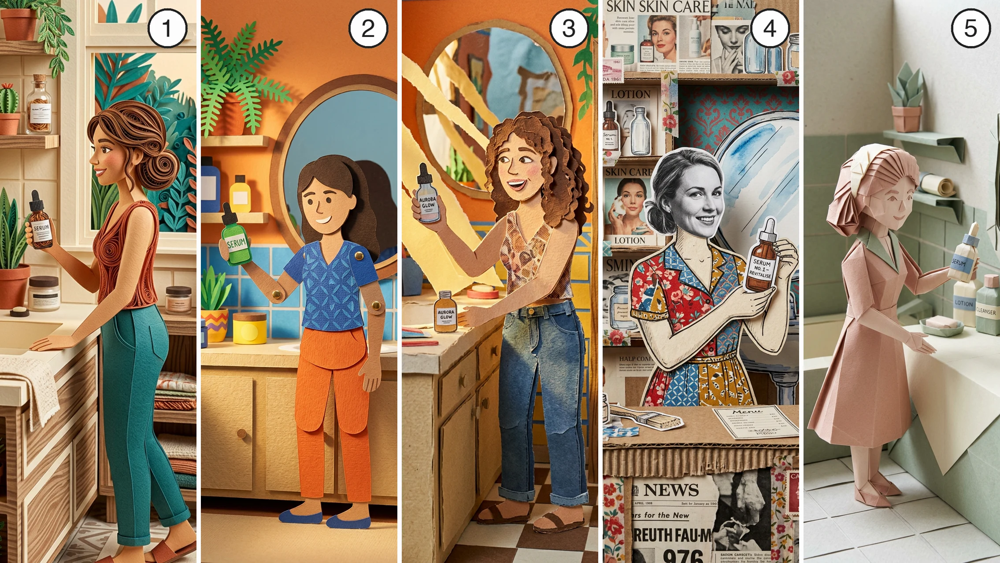

# paper-animation SKILL

The paper visual style family for AI video ads. Every image made under this skill exists to be animated: it is a start frame, beat reference, or hero reference for a video draft - a still of one beat of the ad, visualizing what the voiceover says at that moment (the problem, the agitation, the mechanism, the solution, the transformation). Two things make the output win: every frame must read as **photographed physical paper** (visible grain, edge thickness, real cast shadows - or the model drifts into flat digital vector illustration), and every frame must be a **self-contained scene shot from inside the paper world** (or the model shows you the craft object instead of an animatable scene).

## Scope

This is a style skill, not a format. It defines the look and how to prompt it; it does not carry a production pipeline. Plan the ad first (script, then the voiceover as the pacing source, then the storyboard), and apply this skill at the prompting steps - the image prompts that produce each beat's start frame and reference images, and the video prompts that animate them into the sequence. The style suits voiceover + B-roll content best: paper worlds illustrate a narration rather than lip-sync a character.

## What makes anything read as paper (apply to every sub-style)

1. **Visible material texture** on every element - paper grain, fibers, cardstock weight.
2. **Physically plausible cast shadows** between layers - shadows are how flat art gains depth.
3. **Imperfect edges** - torn, scissor-cut, or white-bordered; never a clean vector line.
4. **Planar motion** - elements slide, pivot, and parallax as flat planes; paper never squashes, stretches, or moves organically.
5. **Stepped, stuttered timing** - handmade cadence, not smooth easing.

## The camera lives inside the paper world (apply to every sub-style)

Every image is a still the video model will animate - the beat has to flow out of it (elements sliding in, a parallax push, a cut into the next beat), so it must be a self-contained scene: the paper world extends past every edge of the frame, and the camera sits inside it - eye level with a paper character, worm's-eye up at the cardstock buildings, overhead looking down on the paper street, any dynamic angle, as long as it is an interior view of the scene. State the camera position inside the world in every prompt.

Watch for the exterior-view failure: certain craft words ("diorama," "shadow box," "tabletop," "model") pull the model into showing the craft object from outside - a framed box like a painting, a workbench with the scene on it, a flat-lay board with items pasted on it. The style blocks below avoid those words; if a result still shows a frame, table edge, or board, re-anchor with "the paper scene fills the entire frame, the camera is inside the scene."

## The physicality block (reusable verbatim)

Append to every image prompt in any sub-style - the anti-vector-drift insurance, phrased to stay inside the scene:

```
Everything in frame is real physical paper, photographed — visible paper grain and fibers, cut edges showing paper thickness, real cast shadows, soft studio lighting, the paper scene filling the entire frame.
```

## Sub-style menu (pick one per video; name it to the user)

Pick the execution by content fit, or use the one the user names. Keep one sub-style per video - the locked style block goes verbatim at the top of every image and video prompt in that video.

**The five styles, side by side** - one identical scene in each, numbered:



Pick your style by number:

1 = Layered papercraft world · 2 = Flat construction-paper cutout · 3 = Handmade stop-motion paper · 4 = Mixed-media collage · 5 = Origami world

Once picked, that sub-style's block opens every image and video prompt in your video, word for word. Want a different kind of paper style? Describe it, then build your own style block from the paper fundamentals above - texture, shadows, imperfect edges, camera inside the scene - and lock it the same way.

### 1. Layered papercraft world (volumetric lane)

- **Visual anchors:** everything built from stacked cardstock with visible paper thickness on every cut edge, deep layered depth between foreground, midground and background paper planes, layered cast shadows, rich sophisticated palettes, backlit glow where warmth is wanted, paper quilling details.
- **Best for:** hero product shots, premium/gift feel, title cards, depth-parallax camera pushes. The most sophisticated-looking lane.
- **Style block:** `Layered papercraft world - everything built from stacked cardstock with visible paper thickness, deep layered depth between foreground, midground and background paper planes, layered cast shadows, paper quilling details, the camera inside the scene and the paper world extending past every edge of the frame.`

### 2. Flat construction-paper cutout (South Park lane)

- **Visual anchors:** flat layered card shapes, snipped edges, visible construction-paper grain, bold hard color fills, jointed paper-puppet limbs, soft drop shadows between flat layers.
- **Best for:** comedy, character skits, low-fi charm, ironic tones.
- **Style block:** `Flat construction-paper cutout scene - simple layered flat card shapes, snipped edges, visible paper grain, jointed paper puppet characters, soft drop shadows between the layers, bold flat colors, the scene filling the entire frame with the camera inside the paper world.`

### 3. Handmade stop-motion paper (handmade jitter lane)

- **Visual anchors:** torn edges, visible glue seams, finger-crumpled textures, hand-placed imperfection, soft practical lighting with visible falloff; in motion, 12fps stepping with no motion blur.
- **Best for:** handmade warmth and authenticity; proven high-engagement for short-form product ads.
- **Style block:** `Handmade paper stop-motion scene - torn paper edges, visible glue seams, construction-paper grain, hand-placed imperfection, soft practical lighting with visible falloff, the scene filling the entire frame.`

### 4. Mixed-media collage (colorized editorial lane)

- **Visual anchors:** the entire scene built from cutouts composed into one deep coherent world: black-and-white photographic cutout faces on hand-drawn paper bodies, clothing collaged from colorful patterned paper, structures built from cardboard and newspaper fragments, vintage magazine clippings, washi tape strips and vintage stamps tucked through the scene, hand-drawn ink details over the paper. Rich saturated collage colors against newsprint neutrals. The background is part of the scene, never a visible board behind pasted items.
- **Best for:** explainer/editorial arguments, story-driven ads with a human subject, eclectic brand storytelling. A real product photo stays photographic as a cutout inside the collaged world.
- **Style block:** `Mixed-media paper collage world - the entire scene built from cutouts composed into one deep coherent scene: black-and-white photographic cutout faces on hand-drawn paper bodies, clothing collaged from colorful patterned paper, structures built from cardboard and newspaper fragments, vintage magazine clippings, washi tape strips and vintage stamps tucked through the scene, hand-drawn ink details over the paper, rich saturated collage colors against newsprint neutrals, the camera inside the scene.`

### 5. Origami world (folded-paper lane)

- **Visual anchors:** everything folded from paper with clean geometric creases - delicate origami figures, crisp angular folds on every object, pleated paper details (pleated towels, a pleated mirror frame), soft diffused lighting casting gentle shadows that reveal the dimensional paper folds, the handcrafted feel of a stop-motion paper world.
- **Palette exception:** soft pastels - blush, sage, cream - with gentle contrast between the folded forms. The one lane that overrides the saturated-color rule: quiet uniform surfaces let the fold shadows carry the frame.
- **Best for:** calm premium and gentle brand tones, elegant product stories, whimsical charm - and transformation concepts, where the pop-up-unfold transition is at home.
- **Style block:** `Origami world scene - everything folded from paper with clean geometric creases: delicate origami figures, crisp angular folds on every object, pleated paper details, soft pastel-colored papers, soft diffused lighting casting gentle shadows that reveal the dimensional paper folds, the handcrafted feel of a stop-motion paper world, the scene filling the entire frame with the camera inside the paper world.`
- **Physicality block variant:** in this lane say "real physical folded paper" and "crisp crease lines, folded edges showing paper thickness" in place of the cut-edge wording.

## Prompt rules

- **Style block first.** The sub-style's block opens every image and video prompt, verbatim, then the scene. Consistency across shots comes from repeating the block plus reusing hero references - never from "same style as before."
- **Image model: Nano Banana 2 first; GPT Image 2 is the second take.** This skill's image drafts default to Nano Banana 2 - the more creative paper renderer. The two models execute these styles drastically differently, so when a result misses the style, regenerate the identical prompt on GPT Image 2 before rewriting the prompt: the model swap is a style lever of its own. Offer it to a user who isn't loving the look.
- **Color: saturated and high-contrast.** Paper styles come alive on strong color - saturated hues with clear contrast between adjacent layers and between subject and background. State the palette explicitly in every prompt ("saturated greens stepping from lime to deep forest," "a vivid orange sun against a pale sky"). This holds across every lane except origami world, which runs soft pastel (its lane notes).
- **State the camera position inside the world in every prompt** - "at eye level with the paper character," "worm's-eye view up at the cardstock towers," "overhead view straight down on the paper street." The angle is free per shot; the interior viewpoint is not.
- **Say "papercraft," not "paper cut," near faces and products.** "Paper cut" blurs fine features; "papercraft" holds them. Any prompt containing a character face or a recognizable product uses papercraft phrasing.
- **The product stays photographic in the collage lane.** In mixed-media collage, the product is a photographic cutout with rough scissor-cut edges composed into the scene - attach the product reference image and describe it as a photo cutout, so the label stays accurate.
- **Weave the material into every scene element.** In image prompts, name the paper treatment on each major object - "pleated paper towels," "a serum bottle snipped from green card," "shelves layered from vintage magazine clippings" - not just in the style block. In video prompts, repeat the material words in the action lines ("the paper waves slide," "the cardstock sun pivots") so the texture survives motion.
- **Text overlays happen in post** - paper-style captions and annotations included; never ask the video model to render text.

## Motion vocabulary (video prompts)

Name the motion feel explicitly - left unprompted, video models interpolate to smooth 24fps organic motion and the paper style dies. Include in every video prompt: `stop-motion cadence, 12 fps judder, slight frame-to-frame jitter, no motion blur` (soften to "subtle stepped motion" for the papercraft-world lane if full judder is too rough).

| Move                              | How to prompt it                                                                              | Reliability                                               |
| --------------------------------- | --------------------------------------------------------------------------------------------- | --------------------------------------------------------- |
| Slide / rotate flat elements      | "the paper [element] slides across the frame," "pivots at one corner"                         | Good                                                      |
| Parallax push through layers      | "slow push-in through the layered paper planes, parallax between foreground and background"   | Good - the strongest AI paper move; lead with it          |
| Hinge-jointed limbs / flap mouths | "jointed paper puppet raises one arm, pivoting at the shoulder" - one simple gesture per shot | Medium - models over-smooth into organic motion           |
| Pop-in with hard drop shadow      | "a paper [element] pops into frame with its shadow"                                           | Medium - timing is imprecise; precise pops go to the edit |
| Self-drawing pencil lines         | Do not ask the video model - add as a motion-graphics overlay in post                         | Weak in-model                                             |

## Paper transitions (between scenes)

Paper's superpower over other skins: the material itself can carry the transition, so scene changes become moments of delight instead of hard cuts. Use one wherever the storyboard moves between settings; keep hard cuts for beat changes inside a setting.

| Transition             | What happens                                                                                                                | Prompt language                                                                                                             |
| ---------------------- | --------------------------------------------------------------------------------------------------------------------------- | --------------------------------------------------------------------------------------------------------------------------- |
| Storybook page turn    | The whole scene lifts and turns like a page of a book; the next scene is the next page                                      | "the entire paper scene lifts at one edge and turns like a storybook page, revealing the next scene beneath"                |
| Cut-through push       | The camera pushes into a cutout opening (a hole, a doorway, a paper window); the next scene lies beyond it                  | "slow push-in into the cutout opening; the opening fills the frame and the next scene lies inside it"                       |
| Layer peel             | The top paper layer peels back and lifts away, revealing the next scene as the layer beneath                                | "the top paper layer peels back from one corner and lifts away, revealing the next scene beneath it"                        |
| Assemble / disassemble | The current scene's cutouts slide apart and exit; the next scene's pieces slide in and settle into place with their shadows | "the paper pieces of the scene slide apart and exit the frame; the pieces of the next scene slide in and settle into place" |
| Pop-up unfold          | The next scene rises and unfolds like a pop-up book spread opening                                                          | "the scene folds flat and closes; the next scene rises and unfolds like a pop-up book spread"                               |
| Torn reveal            | A tear sweeps across the frame, ripped edge leading, with the next scene behind the tear                                    | "a torn paper edge sweeps across the frame, tearing the scene away to reveal the next scene behind it"                      |
| Foreground wipe        | The camera pans or pushes past a large foreground paper element that briefly fills the frame, emerging into the new scene   | "the camera pans past a large foreground paper cloud that fills the frame, and emerges into the next scene"                 |

**Three ways to execute a transition** (depending on how your video model takes frames):

1. **Inside one multi-beat draft (default):** when both scenes share one generation, name the transition at the cut between shot blocks, per the parent's prompt backbone ("Shot 2: the entire paper scene lifts and turns like a storybook page…").
2. **Start/end frame:** the transition gets its own generation - start frame = the last still of scene A, end frame = the first still of scene B, and the prompt describes the paper move between them. Maximum control; the clip IS the transition.
3. **Omni-reference:** attach both scene stills and assign each to a beat ("image 1 = the scene the clip opens on; image 2 = the scene it becomes"), then describe the transition carrying one into the other.

## Known limitations & workarounds

| Failure                                                                                      | Fix                                                                                                                                                                              |
| -------------------------------------------------------------------------------------------- | -------------------------------------------------------------------------------------------------------------------------------------------------------------------------------- |
| Output drifts to flat digital vector illustration                                            | Physicality block verbatim; add "everything in frame is real photographed paper"                                                                                                 |
| Shows the craft from outside - a framed box, a workbench, a flat-lay board with pasted items | Strike "diorama / shadow box / tabletop / model" from the prompt; add "the paper scene fills the entire frame, the camera is inside the scene" and a named interior camera angle |
| Collage reads as a flat-lay board of pasted items instead of a scene                         | Compose every element into one deep coherent world; the background is scenery (sky, street, room), never a visible board behind the pieces                                       |
| Faces or product labels blur                                                                 | Use "papercraft" phrasing, not "paper cut"; attach the product/character reference                                                                                               |
| Video motion smooths away the paper feel                                                     | Name the cadence ("12 fps judder, no motion blur"); keep all motion planar                                                                                                       |
| "Stop motion" alone drifts to claymation                                                     | Always pair it with "paper" - "handmade paper stop-motion"                                                                                                                       |
| Style drifts across shots                                                                    | Same style block verbatim in every prompt + hero references re-attached every draft                                                                                              |
